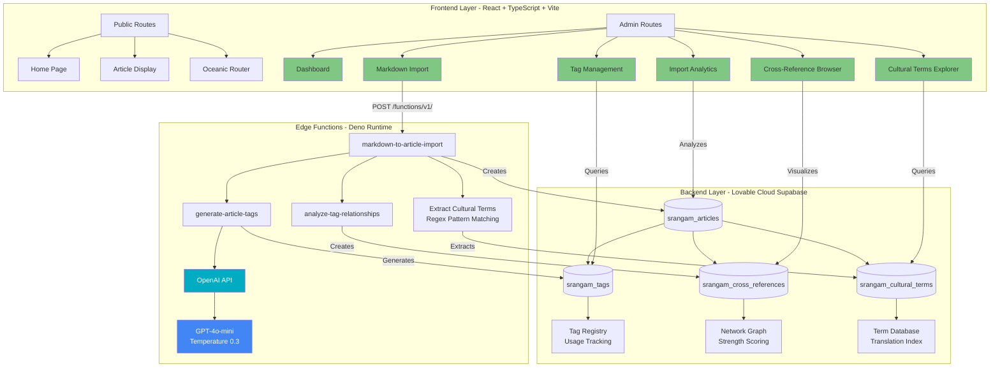
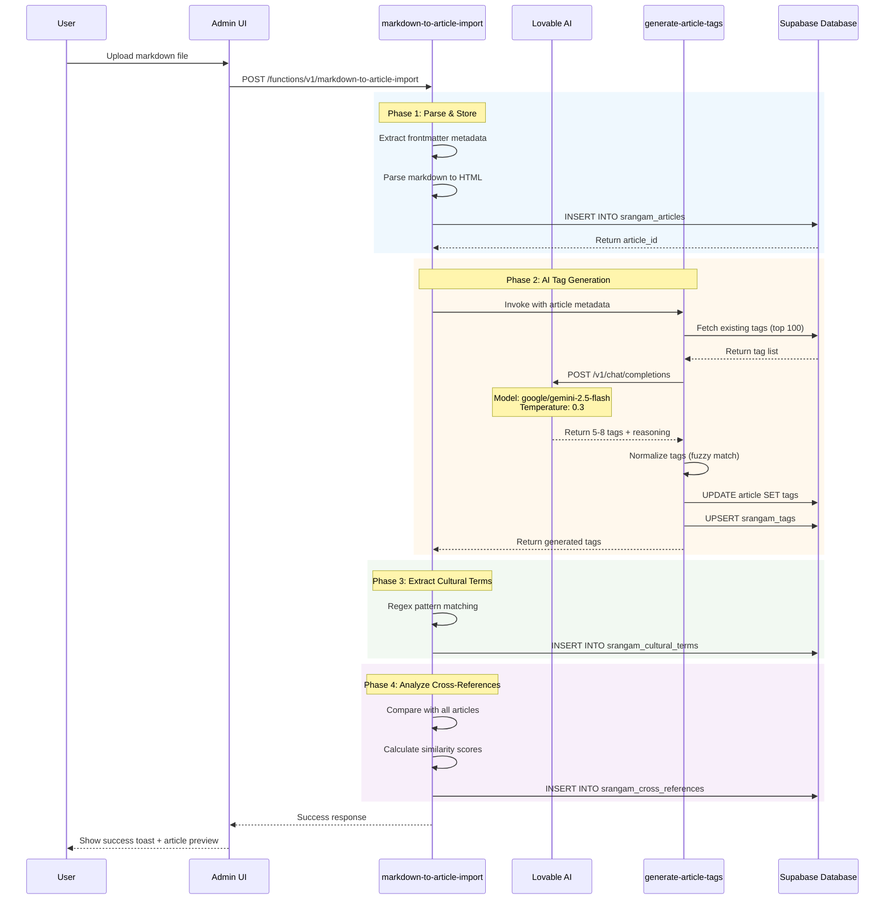
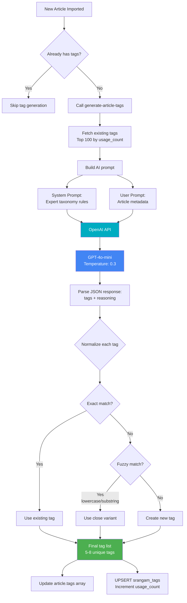
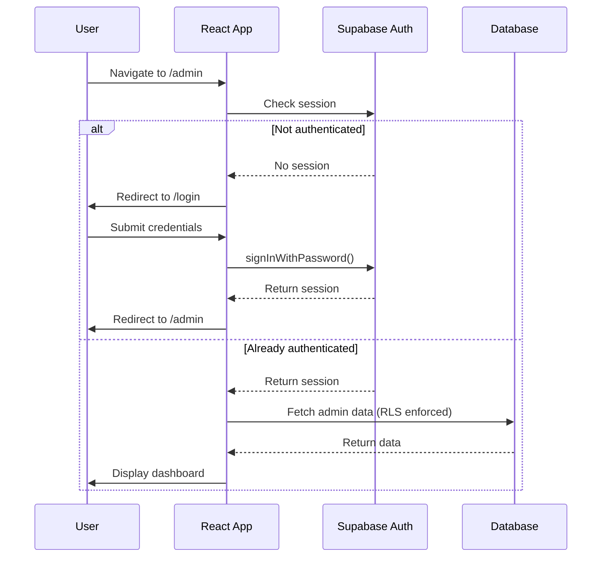

# Admin Dashboard Architecture

## Table of Contents
- [System Overview](#system-overview)
- [Component Hierarchy](#component-hierarchy)
- [Data Flow](#data-flow)
- [Backend Integration](#backend-integration)
- [Security Architecture](#security-architecture)
- [Performance Considerations](#performance-considerations)

## System Overview

The Srangam Admin Dashboard is a comprehensive content management system for scholarly articles about South Asian history and culture. It provides AI-powered content enrichment, network visualization, and multilingual content management.

### Architecture Layers



### Technology Stack

| Layer | Technology | Purpose |
|-------|-----------|---------|
| **Frontend** | React 18 + TypeScript | Component-based UI |
| **Build Tool** | Vite | Fast development & bundling |
| **UI Framework** | Shadcn/UI + Radix UI | Accessible components |
| **Styling** | Tailwind CSS | Utility-first styling |
| **Charts** | Recharts | Data visualization |
| **Network Viz** | react-force-graph-2d | Interactive graphs |
| **Backend** | Supabase PostgreSQL | Database & auth |
| **Edge Functions** | Deno Runtime | Serverless logic |
| **AI** | OpenAI API | GPT-4o-mini integration |

## Component Hierarchy

```mermaid
graph TB
    A[AdminLayout] --> B[Sidebar Navigation]
    A --> C[Content Outlet]
    A --> D[ErrorBoundary]
    
    C --> E[Dashboard]
    C --> F[MarkdownImport]
    C --> G[TagManagement]
    C --> H[CrossReferencesBrowser]
    C --> I[CulturalTermsExplorer]
    C --> J[ImportAnalytics]
    
    E --> E1[StatsCards]
    E --> E2[RecentImportsTable]
    E --> E3[TagGrowthChart]
    
    F --> F1[FileUpload]
    F --> F2[MarkdownPreview]
    F --> F3[ProcessButton]
    
    G --> G1[TagTable]
    G --> G2[EditDialog]
    G --> G3[DeleteDialog]
    G --> G4[CategoryPieChart]
    G --> G5[Top20BarChart]
    
    H --> H1[ForceGraph2D]
    H --> H2[ReferenceListTable]
    H --> H3[ArticleDetailSheet]
    H --> H4[FilterControls]
    
    I --> I1[TermsTable]
    I --> I2[UsageBarChart]
    I --> I3[ModulePieChart]
    
    J --> J1[ImportTimeline]
    J --> J2[ReadTimeDistribution]
    J --> J3[TopAuthorsTable]
    
    style A fill:#4caf50,color:#fff
    style E fill:#81c784
    style F fill:#81c784
    style G fill:#81c784
    style H fill:#81c784
    style I fill:#81c784
    style J fill:#81c784
```



### Routing Structure

```typescript
// Admin routes in App.tsx
/admin
  ├── /admin (Dashboard)
  ├── /admin/import (Markdown Import)
  ├── /admin/tags (Tag Management)
  ├── /admin/cross-references (Network Browser)
  ├── /admin/cultural-terms (Terms Explorer)
  └── /admin/analytics (Import Analytics)
```

## Data Flow

### Markdown Import Pipeline



### Tag Generation Workflow



### Authentication Flow



## Backend Integration

### Edge Functions

#### 1. markdown-to-article-import

**Purpose**: Process uploaded markdown files and create article records with enrichment

**Endpoint**: `POST /functions/v1/markdown-to-article-import`

**Request Body**:
```typescript
{
  markdownContent: string;
  fileName: string;
  autoGenerateTags?: boolean; // default: true
}
```

**Response**:
```typescript
{
  success: boolean;
  article_id: string;
  slug: string;
  stats: {
    tags_generated: number;
    cultural_terms_extracted: number;
    cross_references_created: number;
  }
}
```

**Process**:
1. Parse frontmatter (YAML)
2. Convert markdown to HTML
3. Insert article record
4. Invoke tag generation (if enabled)
5. Extract cultural terms via regex
6. Analyze cross-references
7. Return summary

---

#### 2. generate-article-tags

**Purpose**: Generate 5-8 semantic tags using AI

**Invoked by**: `markdown-to-article-import`

**Parameters**:
```typescript
{
  title: string;
  theme: string;
  culturalTerms: string[];
  contentPreview: string;
}
```

**AI Model**: OpenAI GPT-4o-mini

**Temperature**: 0.3 (for consistency)

**Response**:
```typescript
{
  success: boolean;
  tags: string[];
  confidence: number;
  message: string;
}
```

---

#### 3. analyze-tag-relationships

**Purpose**: Compute tag co-occurrence matrix for smart suggestions

**Endpoint**: `POST /functions/v1/analyze-tag-relationships`

**Process**:
1. Query all articles with tags
2. Calculate co-occurrence scores
3. Update `related_tags` field in srangam_tags
4. Return statistics

**Scheduled**: Run weekly or after bulk imports

## Security Architecture

### Row Level Security (RLS) Policies

#### srangam_articles

```sql
-- Public read access for published articles
CREATE POLICY "Public read published articles"
ON srangam_articles FOR SELECT
USING (status = 'published');

-- Authenticated users can manage all articles
CREATE POLICY "Authenticated manage articles"
ON srangam_articles FOR ALL
USING (auth.role() = 'authenticated')
WITH CHECK (auth.role() = 'authenticated');
```

#### srangam_tags

```sql
-- Everyone can view tags
CREATE POLICY "Tags are viewable by everyone"
ON srangam_tags FOR SELECT
USING (true);

-- Authenticated users can insert/update tags
CREATE POLICY "Authenticated users can insert tags"
ON srangam_tags FOR INSERT
WITH CHECK (true);

CREATE POLICY "Authenticated users can update tags"
ON srangam_tags FOR UPDATE
USING (true);
```

#### srangam_cross_references

```sql
-- Public read access
CREATE POLICY "Public read cross references"
ON srangam_cross_references FOR SELECT
USING (true);

-- Authenticated users can manage
CREATE POLICY "Authenticated manage cross references"
ON srangam_cross_references FOR ALL
USING (auth.role() = 'authenticated')
WITH CHECK (auth.role() = 'authenticated');
```

### Edge Function Security

- **Service Role Key**: Edge functions use service role for database access
- **Input Validation**: All user inputs are validated and sanitized
- **Rate Limiting**: Implemented at Supabase project level
- **CORS**: Configured for admin domain only

## Performance Considerations

### Query Optimization

#### Database Indexes

```sql
-- Article lookups
CREATE INDEX idx_articles_slug ON srangam_articles(slug);
CREATE INDEX idx_articles_theme ON srangam_articles(theme);
CREATE INDEX idx_articles_status ON srangam_articles(status);

-- Tag queries
CREATE INDEX idx_tags_usage ON srangam_tags(usage_count DESC);
CREATE INDEX idx_tags_category ON srangam_tags(category);

-- Cross-reference network
CREATE INDEX idx_cross_refs_source ON srangam_cross_references(source_article_id);
CREATE INDEX idx_cross_refs_target ON srangam_cross_references(target_article_id);
CREATE INDEX idx_cross_refs_strength ON srangam_cross_references(strength DESC);
```

### React Query Caching

```typescript
// Default staleTime: 5 minutes
const queryClient = new QueryClient({
  defaultOptions: {
    queries: {
      staleTime: 5 * 60 * 1000,
      cacheTime: 10 * 60 * 1000,
      refetchOnWindowFocus: false,
    },
  },
});
```

**Cached Queries**:
- Article list: 5 min
- Tag list: 10 min
- Cross-references: 5 min
- Cultural terms: 10 min

### Loading States

All admin pages implement:
1. **Skeleton loaders** during initial data fetch
2. **Optimistic updates** for mutations
3. **Error boundaries** for graceful degradation
4. **Toast notifications** for user feedback

### Bundle Optimization

- **Code splitting** by route (React.lazy)
- **Tree shaking** via Vite
- **Minification** in production build
- **Lazy loading** of charts and network graph

## Monitoring & Debugging

### Edge Function Logs

Access via Lovable Cloud:
```
Settings → Cloud → Edge Functions → View Logs
```

Key metrics:
- Execution time
- Error rate
- AI API usage
- Database query count

### Database Performance

Monitor via Supabase dashboard:
- Query execution time
- Index usage
- Connection pool stats

### Frontend Debugging

```typescript
// Enable React Query DevTools in development
import { ReactQueryDevtools } from '@tanstack/react-query-devtools';

<ReactQueryDevtools initialIsOpen={false} />
```

## Future Enhancements

1. **Real-time Collaboration**: WebSocket-based multi-user editing
2. **Version Control**: Article revision history with diff viewer
3. **Advanced Search**: Full-text search with Postgres FTS
4. **Bulk Operations**: CSV import/export for tags and terms
5. **Analytics Dashboard**: User engagement metrics
6. **Email Notifications**: Alert on new articles or comments
