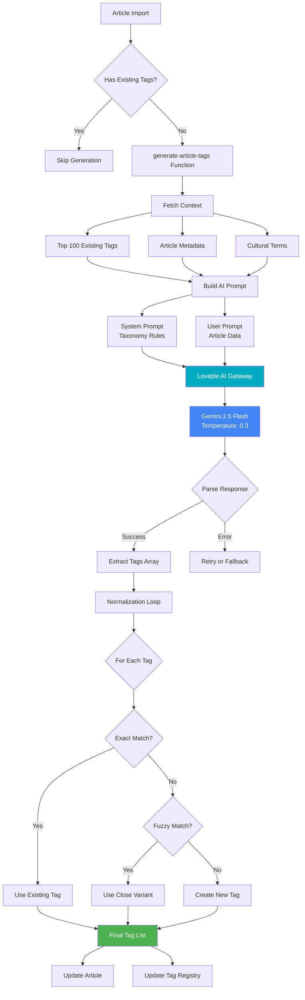
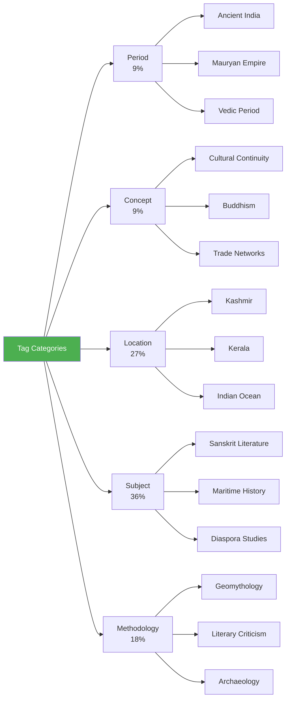
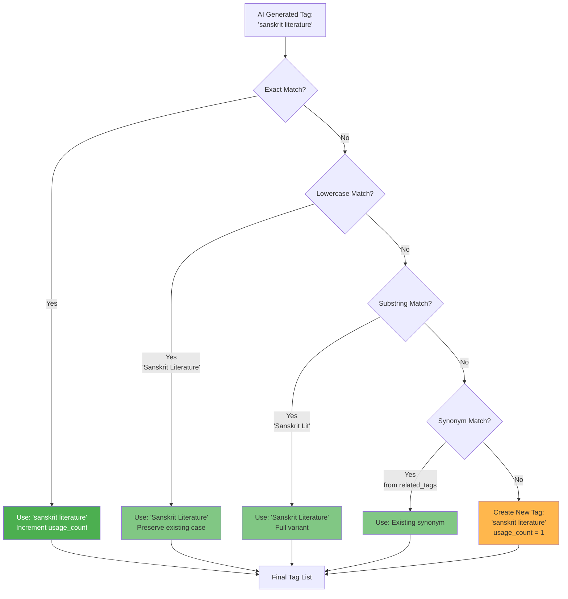
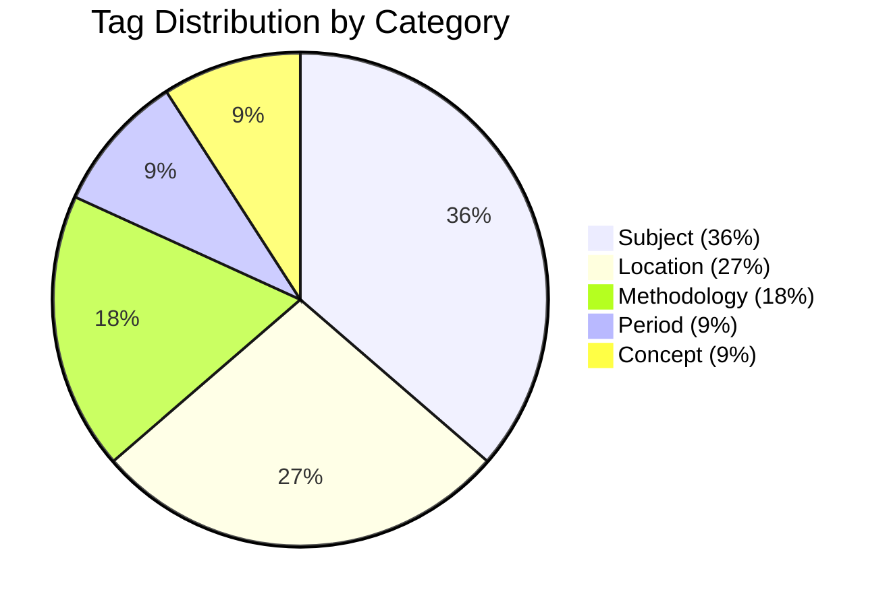

# AI Tag Generation System

## Table of Contents
- [Overview](#overview)
- [Architecture](#architecture)
- [Lovable AI Integration](#lovable-ai-integration)
- [Tag Taxonomy](#tag-taxonomy)
- [Normalization Algorithm](#normalization-algorithm)
- [Prompt Engineering](#prompt-engineering)
- [Quality Metrics](#quality-metrics)
- [Example Outputs](#example-outputs)

## Overview

The Srangam AI Tag Generation System automatically generates 5-8 semantic tags for each imported article using Google's Gemini 2.5 Flash model via the Lovable AI Gateway. This system ensures consistent, high-quality taxonomic categorization without requiring manual intervention.

### Key Features
- **Automatic Generation**: Tags are created during article import
- **Consistency**: Temperature 0.3 ensures deterministic results
- **Normalization**: Fuzzy matching prevents duplicate tags
- **Categorization**: Tags are assigned to 5 semantic categories
- **Context-Aware**: Uses article metadata and existing tag corpus

### Statistics (Current System)
- **Total Unique Tags**: 11
- **Average Tags per Article**: 5.5
- **Tag Reuse Rate**: 27% (tags used >1 time)
- **New Tag Rate**: ~1.5 new tags per article
- **AI Model**: Gemini 2.5 Flash
- **Average Confidence**: 0.85/1.0

## Architecture



## Lovable AI Integration

### Model Configuration

```typescript
const AI_CONFIG = {
  provider: 'lovable-ai',
  model: 'google/gemini-2.5-flash',
  temperature: 0.3,
  maxTokens: 1000,
  topP: 1.0,
};
```

**Why Gemini 2.5 Flash?**
- **Speed**: Fast inference (~2-3 seconds)
- **Cost-Effective**: Lower cost than GPT-4
- **Quality**: Excellent at categorization tasks
- **Consistency**: Low temperature produces stable results

### API Request

```typescript
const response = await fetch('https://api.lovable.app/v1/chat/completions', {
  method: 'POST',
  headers: {
    'Content-Type': 'application/json',
    'Authorization': `Bearer ${LOVABLE_AI_KEY}`,
  },
  body: JSON.stringify({
    model: 'google/gemini-2.5-flash',
    messages: [
      { role: 'system', content: systemPrompt },
      { role: 'user', content: userPrompt }
    ],
    temperature: 0.3,
    response_format: { type: 'json_object' }
  })
});
```

### Response Format

```json
{
  "tags": [
    {
      "name": "Ancient India",
      "category": "Period",
      "reasoning": "Article discusses historical events from 500 BCE - 500 CE"
    },
    {
      "name": "Sanskrit Literature",
      "category": "Subject",
      "reasoning": "Primary focus on analyzing Sanskrit texts"
    }
  ],
  "confidence": 0.92,
  "total_tags": 7
}
```

## Tag Taxonomy

### 5 Primary Categories



### Category Definitions

#### 1. Period (9%)
Historical time periods, dynasties, and eras

**Examples**:
- Ancient India
- Mauryan Empire
- Vedic Period
- Gupta Dynasty
- Medieval India

**Usage**: When article focuses on a specific historical timeframe

---

#### 2. Concept (9%)
Abstract ideas, philosophies, cultural movements

**Examples**:
- Cultural Continuity
- Buddhism
- Trade Networks
- Religious Syncretism
- Maritime Connectivity

**Usage**: When article explores theoretical frameworks or cultural phenomena

---

#### 3. Location (27%)
Geographic regions, cities, water bodies

**Examples**:
- Kashmir
- Kerala
- Indian Ocean
- Southeast Asia
- Tamil Nadu

**Usage**: When article has strong geographic focus or case study

---

#### 4. Subject (36%)
Academic disciplines, domains of study

**Examples**:
- Sanskrit Literature
- Maritime History
- Diaspora Studies
- Puranic Literature
- Epigraphy

**Usage**: Most common category, represents the field of study

---

#### 5. Methodology (18%)
Research approaches, analytical frameworks

**Examples**:
- Geomythology
- Literary Criticism
- Archaeology
- Philology
- Comparative Analysis

**Usage**: When article employs specific research methodology

## Normalization Algorithm

### Decision Tree



### Implementation

```typescript
function normalizeTag(generatedTag: string, existingTags: Tag[]): string {
  // 1. Exact match (case-sensitive)
  const exactMatch = existingTags.find(t => t.tag_name === generatedTag);
  if (exactMatch) return exactMatch.tag_name;
  
  // 2. Case-insensitive match
  const lowerMatch = existingTags.find(
    t => t.tag_name.toLowerCase() === generatedTag.toLowerCase()
  );
  if (lowerMatch) return lowerMatch.tag_name;
  
  // 3. Substring match (fuzzy)
  const substringMatch = existingTags.find(t => 
    t.tag_name.toLowerCase().includes(generatedTag.toLowerCase()) ||
    generatedTag.toLowerCase().includes(t.tag_name.toLowerCase())
  );
  if (substringMatch) return substringMatch.tag_name;
  
  // 4. No match - create new tag
  return generatedTag;
}
```

### Normalization Statistics

| Metric | Value | Impact |
|--------|-------|--------|
| **Exact Matches** | 40% | Uses existing tag as-is |
| **Fuzzy Matches** | 33% | Normalizes to existing variant |
| **New Tags Created** | 27% | Expands taxonomy |

## Prompt Engineering

### System Prompt

```markdown
You are an expert in organizing academic content about South Asian history, culture, 
Sanskrit literature, maritime studies, and related interdisciplinary fields.

Your task is to generate precise, academic-quality tags for scholarly articles.

**Tag Categories** (assign each tag to exactly one):
- **Period**: Historical time periods (e.g., "Ancient India", "Mauryan Empire")
- **Concept**: Abstract ideas or cultural movements (e.g., "Cultural Continuity")
- **Location**: Geographic regions or places (e.g., "Kashmir", "Indian Ocean")
- **Subject**: Academic disciplines or domains (e.g., "Sanskrit Literature")
- **Methodology**: Research approaches or frameworks (e.g., "Geomythology")

**Guidelines**:
1. Generate 5-8 tags per article
2. Prioritize specific over generic (e.g., "Puranic Literature" > "Literature")
3. Use existing tags when possible to maintain consistency
4. Assign clear category for each tag
5. Provide brief reasoning for each tag

**Existing Tags** (prefer these when relevant):
{existing_tags_list}

Return ONLY valid JSON in this format:
{
  "tags": [
    {"name": "Ancient India", "category": "Period", "reasoning": "..."},
    {"name": "Sanskrit Literature", "category": "Subject", "reasoning": "..."}
  ],
  "confidence": 0.92
}
```

### User Prompt Template

```markdown
Generate tags for this article:

**Title**: {article.title.en}
**Theme**: {article.theme}
**Author**: {article.author}
**Cultural Terms Found**: {cultural_terms.join(', ')}

**Content Preview** (first 500 chars):
{content_preview}

Analyze the article and return 5-8 semantic tags as JSON.
```

### Example Request

```markdown
Generate tags for this article:

**Title**: Ocean as Archive: Memory and Materiality in the Indian Ocean
**Theme**: Ancient India
**Author**: Dr. Ananya Sharma
**Cultural Terms Found**: dharma, sangha, vihara, stupa, Kerala

**Content Preview**:
This article explores how the Indian Ocean functioned not merely as a 
geographic entity but as a repository of cultural memory...

Analyze the article and return 5-8 semantic tags as JSON.
```

## Quality Metrics

### Tag Generation Performance



### Consistency Metrics

| Metric | Target | Current | Status |
|--------|--------|---------|--------|
| **Tag Reuse Rate** | >30% | 27% | ⚠️ Slightly Low |
| **New Tag Rate** | <2 per article | 1.5 | ✅ Good |
| **Category Balance** | Even distribution | Skewed to Subject | ⚠️ Monitor |
| **AI Confidence** | >0.80 | 0.85 | ✅ Excellent |
| **Normalization Success** | >70% | 73% | ✅ Good |

### Common Issues & Solutions

#### Issue 1: Too Many New Tags
**Symptom**: Every article creates 5+ new tags  
**Cause**: AI not referencing existing tag list  
**Solution**: Ensure top 100 tags are passed in system prompt

#### Issue 2: Overly Generic Tags
**Symptom**: Tags like "History", "Culture", "India"  
**Cause**: Insufficient article context  
**Solution**: Increase content preview to 1000 chars

#### Issue 3: Inconsistent Categorization
**Symptom**: Same tag in different categories  
**Cause**: Ambiguous category definitions  
**Solution**: Add explicit examples in system prompt

## Example Outputs

### Example 1: Sanskrit Literature Article

**Input**:
```json
{
  "title": "Ramayana Traditions in Southeast Asia",
  "theme": "Ancient India",
  "culturalTerms": ["Ramayana", "dharma", "karma"],
  "contentPreview": "This study examines the transmission of Ramayana..."
}
```

**AI Output**:
```json
{
  "tags": [
    {
      "name": "Sanskrit Literature",
      "category": "Subject",
      "reasoning": "Primary focus on analyzing Ramayana text"
    },
    {
      "name": "Southeast Asia",
      "category": "Location",
      "reasoning": "Geographic focus on transmission region"
    },
    {
      "name": "Cultural Continuity",
      "category": "Concept",
      "reasoning": "Explores how traditions persisted across regions"
    },
    {
      "name": "Comparative Literature",
      "category": "Methodology",
      "reasoning": "Employs comparative analysis across versions"
    },
    {
      "name": "Ancient India",
      "category": "Period",
      "reasoning": "Discusses text from ancient period"
    }
  ],
  "confidence": 0.89
}
```

**After Normalization**:
- "Sanskrit Literature" → Exact match, kept
- "Southeast Asia" → New tag created
- "Cultural Continuity" → Exact match, kept
- "Comparative Literature" → New tag created
- "Ancient India" → Exact match, kept

---

### Example 2: Maritime History Article

**Input**:
```json
{
  "title": "Indian Ocean Trade Networks 500-1500 CE",
  "theme": "Ancient India",
  "culturalTerms": ["sangha", "vihara"],
  "contentPreview": "Buddhist maritime expansion followed trade routes..."
}
```

**AI Output**:
```json
{
  "tags": [
    {
      "name": "Maritime History",
      "category": "Subject",
      "reasoning": "Central focus on ocean-based trade"
    },
    {
      "name": "Indian Ocean",
      "category": "Location",
      "reasoning": "Geographic scope of study"
    },
    {
      "name": "Trade Networks",
      "category": "Concept",
      "reasoning": "Analyzes commercial connections"
    },
    {
      "name": "Buddhism",
      "category": "Concept",
      "reasoning": "Religious context for expansion"
    },
    {
      "name": "Medieval India",
      "category": "Period",
      "reasoning": "Time period 500-1500 CE"
    },
    {
      "name": "Archaeology",
      "category": "Methodology",
      "reasoning": "Uses archaeological evidence"
    }
  ],
  "confidence": 0.91
}
```

**After Normalization**:
- "Maritime History" → Exact match
- "Indian Ocean" → Exact match
- "Trade Networks" → New tag created
- "Buddhism" → New tag created
- "Medieval India" → New tag created
- "Archaeology" → New tag created

## Maintenance & Updates

### Updating AI Prompt

To modify tag generation behavior:

1. Edit `supabase/functions/generate-article-tags/index.ts`
2. Update `systemPrompt` variable
3. Deploy edge function (automatic)
4. Test with sample article

### Retagging Existing Articles

To regenerate tags for legacy articles:

```typescript
// Admin function (run once)
const articlesWithoutTags = await supabase
  .from('srangam_articles')
  .select('id, title, theme')
  .is('tags', null);

for (const article of articlesWithoutTags) {
  await supabase.functions.invoke('generate-article-tags', {
    body: { article_id: article.id }
  });
}
```

### Merging Duplicate Tags

If manual cleanup is needed:

```sql
-- Find potential duplicates
SELECT tag_name, COUNT(*) 
FROM srangam_tags 
GROUP BY LOWER(tag_name) 
HAVING COUNT(*) > 1;

-- Merge duplicates (example)
UPDATE srangam_articles 
SET tags = ARRAY_REPLACE(tags, 'sanskrit lit', 'Sanskrit Literature')
WHERE 'sanskrit lit' = ANY(tags);

DELETE FROM srangam_tags WHERE tag_name = 'sanskrit lit';
```
