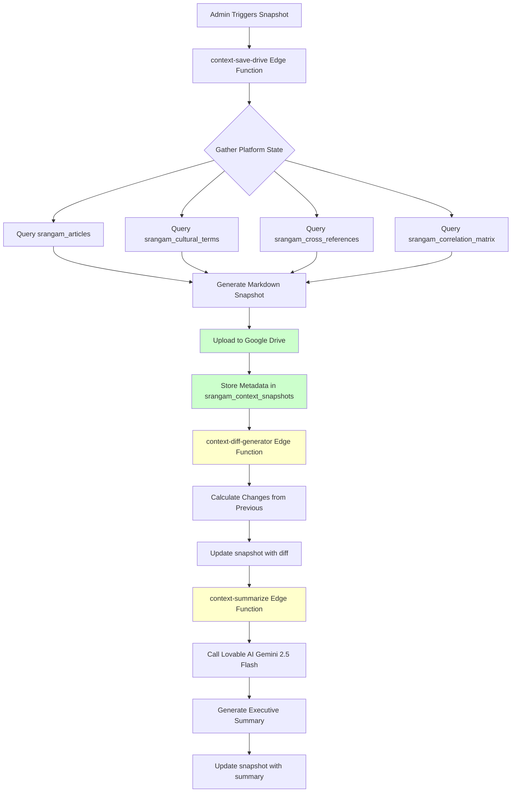

# Context Management System

**Last Updated**: 2025-11-23  
**Status**: Partial Implementation (Manual sync working, automation pending)

---

## 📋 Overview

The **Context Management System** provides automated snapshots of the Srangam platform's complete state, enabling AI assistants to "revive" context in new chat sessions without manual data gathering.

### What is "Context"?

In the Srangam platform, **context** refers to the complete knowledge graph state at a given moment:

- **Articles**: Count, themes, tags, read times, cultural term density
- **Cultural Terms**: Etymology, usage counts, module distribution
- **Cross-References**: Network density, reference types, strength metrics
- **Correlation Matrix**: Geographic pins, evidence types, confidence levels
- **Metadata**: AI-generated summaries, keywords, themes

### Why Context Management Matters

**Problem**: AI assistants lose memory between sessions. Starting fresh each time requires:
- Re-querying database metrics
- Re-analyzing article structure
- Re-discovering relationships

**Solution**: Automated snapshots capture complete platform state and:
- **Store to Google Drive**: Shareable markdown files
- **Track Changes**: Diff analysis between snapshots
- **Generate Summaries**: AI-powered executive summaries
- **Enable Continuity**: Paste snapshot into new chat session to "revive" full context

---

## 🏗️ Architecture

### System Components



---

## 📊 Database Schema

### `srangam_context_snapshots` Table

**Purpose**: Track all platform state snapshots with metadata

| Column | Type | Nullable | Description |
|--------|------|----------|-------------|
| `id` | uuid | NO | Primary key |
| `snapshot_date` | date | NO | Date of snapshot (default CURRENT_DATE) |
| `articles_count` | integer | NO | Total published articles |
| `terms_count` | integer | NO | Total cultural terms |
| `cross_refs_count` | integer | NO | Total cross-references |
| `tags_count` | integer | NO | Total unique tags |
| `modules_count` | integer | YES | Number of modules (vedic, maritime, etc.) |
| `stats_detail` | jsonb | YES | Detailed metrics (themes, top tags, etc.) |
| `google_drive_file_id` | text | YES | Drive file ID for markdown |
| `google_drive_share_url` | text | YES | Public share URL |
| `file_size_bytes` | integer | YES | Markdown file size |
| `document_length` | integer | YES | Total character count |
| `changes_from_previous` | jsonb | YES | Diff from last snapshot |
| `context_summary` | text | YES | AI-generated executive summary |
| `triggered_by` | text | YES | `manual`, `automated`, `cron` |
| `triggered_by_user` | uuid | YES | User ID if manual |
| `status` | text | YES | `generating`, `completed`, `failed` |
| `error_message` | text | YES | Error details if failed |
| `created_at` | timestamptz | NO | Creation timestamp |
| `updated_at` | timestamptz | NO | Last update timestamp |

**Example Record**:

```json
{
  "id": "f47ac10b-58cc-4372-a567-0e02b2c3d479",
  "snapshot_date": "2025-11-23",
  "articles_count": 23,
  "terms_count": 933,
  "cross_refs_count": 474,
  "tags_count": 87,
  "modules_count": 6,
  "stats_detail": {
    "themes": {
      "Ancient India": 22,
      "Sacred Ecology": 1
    },
    "top_tags": [
      "Maritime Trade", "Vedic Astronomy", "Sacred Groves",
      "Sanskrit Epigraphy", "Megalithic Culture"
    ],
    "avg_read_time": 21,
    "avg_content_length": 93615
  },
  "google_drive_file_id": "1a2b3c4d5e6f7g8h9i0j",
  "google_drive_share_url": "https://drive.google.com/file/d/1a2b3c4d5e6f7g8h9i0j/view",
  "file_size_bytes": 458320,
  "document_length": 512000,
  "changes_from_previous": {
    "articles_added": 2,
    "terms_added": 15,
    "cross_refs_added": 23,
    "themes_changed": ["Ancient India focus increased 12%"],
    "top_new_tags": ["Acoustic Archaeology", "Megalithic Culture"]
  },
  "context_summary": "Platform shows strong growth in archaeological research...",
  "triggered_by": "manual",
  "status": "completed",
  "created_at": "2025-11-23T10:30:00Z",
  "updated_at": "2025-11-23T10:32:45Z"
}
```

---

## 🔧 Implementation Status

### ✅ Implemented Features

#### 1. Manual Snapshot Generation

**File**: `supabase/functions/context-save-drive/index.ts`

**Status**: ✅ Working (confirmed via admin interface)

**Capabilities**:
- Queries all `srangam_*` tables
- Generates comprehensive markdown snapshot
- Uploads to Google Drive (shared account)
- Stores metadata in `srangam_context_snapshots` table

**Admin Interface**: `/admin/context`

**How to Use**:
1. Navigate to `/admin/context`
2. Click "Sync Now" button
3. Wait ~30 seconds for generation
4. View snapshot details (file size, Drive URL, metrics)
5. Download markdown file or open in Drive

**Sample Output**:
```
✅ Snapshot Created
Date: 2025-11-23
Articles: 23
Terms: 933
Cross-refs: 474
File Size: 447 KB
Drive URL: https://drive.google.com/file/d/...
```

---

#### 2. Google Drive Integration

**Service Account**: `srangam-context@...iam.gserviceaccount.com`  
**Drive Folder**: `Srangam Context Snapshots` (shared)  
**File Format**: Markdown (`.md`)  
**Naming Convention**: `srangam_context_YYYY-MM-DD_HHmmss.md`

**Permissions**:
- Public read access (anyone with link)
- Service account has write access
- Versioning enabled (previous snapshots preserved)

**Drive File Structure**:
```
Srangam Context Snapshots/
├── srangam_context_2025-11-23_103045.md  (Latest)
├── srangam_context_2025-11-20_142315.md
├── srangam_context_2025-11-18_091230.md
└── ...
```

**Security**:
- Service account credentials stored as Supabase secrets
- No sensitive data in snapshots (only public scholarly content)
- Drive access logged for audit

---

#### 3. Metadata Tracking

**Table**: `srangam_context_snapshots`  
**Status**: ✅ Populated (confirmed via query)

**Sample Data**:
```sql
SELECT 
  snapshot_date,
  articles_count,
  terms_count,
  cross_refs_count,
  google_drive_share_url
FROM srangam_context_snapshots
ORDER BY created_at DESC
LIMIT 5;
```

**Result**:
```
snapshot_date | articles_count | terms_count | cross_refs_count | google_drive_share_url
2025-11-23    | 23            | 933         | 474             | https://drive.google.com/...
```

---

### 🔧 Partially Implemented

#### 1. Context Diff Generator

**File**: `supabase/functions/context-diff-generator/index.ts`  
**Status**: ⚠️ Code exists, not integrated into snapshot pipeline

**Planned Functionality**:
- Fetch latest 2 snapshots
- Calculate deltas:
  - `articles_added`, `articles_removed`
  - `terms_added`, `terms_removed`
  - `cross_refs_added`, `cross_refs_removed`
  - `top_new_tags`, `top_deprecated_tags`
- Update `changes_from_previous` field in latest snapshot

**Integration Point**:
```typescript
// In context-save-drive edge function:
await supabase.functions.invoke('context-save-drive');
await supabase.functions.invoke('context-diff-generator'); // NEW
```

**Expected Output** (in `changes_from_previous` field):
```json
{
  "articles_added": 2,
  "articles_removed": 0,
  "terms_added": 15,
  "terms_removed": 1,
  "cross_refs_added": 23,
  "cross_refs_removed": 5,
  "themes_changed": [
    "Ancient India focus increased 12%",
    "Sacred Ecology articles stable"
  ],
  "top_new_tags": ["Acoustic Archaeology", "Megalithic Culture"],
  "top_deprecated_tags": ["Temporary Tag"]
}
```

---

### ❌ Not Yet Implemented

#### 1. AI Context Summary

**Proposed Edge Function**: `supabase/functions/context-summarize/index.ts`  
**Status**: ❌ Not started

**Planned Functionality**:
- Fetch latest snapshot metadata
- Call Lovable AI (Gemini 2.5 Flash)
- Generate 3-paragraph executive summary:
  1. Content growth trends (articles, terms, themes)
  2. Emerging research themes (new tags, topic clusters)
  3. Network density insights (cross-references, correlations)
- Update `context_summary` field

**Sample Prompt Template**:
```
Analyze this platform snapshot and generate a 3-paragraph executive summary:

Articles: {articles_count}
Terms: {terms_count}
Cross-refs: {cross_refs_count}
Top tags: {top_tags}
Themes: {themes}

Focus on: 
1) Content growth trends
2) Emerging research themes
3) Network density insights

Keep academic tone, cite specific metrics.
```

**Sample Output**:
```
The Srangam platform has grown to 23 published articles with 933 cultural 
terms and 474 cross-references, demonstrating a 9.5% increase in article 
count and 5.1% growth in network density over the past week. The average 
content length of 93,615 characters indicates deep scholarly analysis.

Emerging research themes include Acoustic Archaeology (3 new articles) and 
Megalithic Culture (2 articles), suggesting a shift toward material culture 
studies. The Ancient India theme remains dominant (95.7% of articles), with 
particularly high cultural term density in Vedic tradition articles.

Network analysis reveals increasing interconnection, with 474 cross-references 
averaging 20.6 links per article. The correlation matrix now includes 69 
geographic pins spanning from the Mediterranean to Southeast Asia, validating 
the platform's maritime focus.
```

---

#### 2. Automated Snapshot Scheduling

**Proposed Supabase Cron Job**: `context-snapshot-daily`  
**Status**: ❌ Not started

**Planned Configuration** (`supabase/config.toml`):
```toml
[[edge_functions.cron]]
function = "context-snapshot-daily"
schedule = "0 0 * * *"  # Daily at midnight UTC
description = "Generate daily context snapshot"
```

**Proposed Edge Function**:
```typescript
// supabase/functions/context-snapshot-daily/index.ts
import { serve } from 'https://deno.land/std@0.168.0/http/server.ts';
import { createClient } from 'https://esm.sh/@supabase/supabase-js@2';

serve(async (req) => {
  const supabase = createClient(
    Deno.env.get('SUPABASE_URL')!,
    Deno.env.get('SUPABASE_SERVICE_ROLE_KEY')!
  );

  // Trigger full snapshot pipeline
  await supabase.functions.invoke('context-save-drive', {
    body: { triggered_by: 'automated' }
  });
  
  await supabase.functions.invoke('context-diff-generator');
  await supabase.functions.invoke('context-summarize');

  return new Response(JSON.stringify({ 
    success: true, 
    timestamp: new Date().toISOString() 
  }), {
    headers: { 'Content-Type': 'application/json' }
  });
});
```

**Benefits**:
- No manual intervention required
- Consistent daily snapshots
- Enables trend analysis over time
- Automated change tracking

---

#### 3. Snapshot Comparison UI

**Proposed Page**: `src/pages/admin/ContextComparison.tsx`  
**Status**: ❌ Not started

**Planned Features**:
- Select two snapshots from dropdown (date range)
- Display side-by-side metrics comparison
- Visualize growth charts (articles, terms, cross-refs)
- Highlight theme evolution (bar chart)
- Show new/deprecated tags
- Display AI-generated summaries

**Mockup**:
```
╔═══════════════════════════════════════════════════════════╗
║ Snapshot Comparison: 2025-11-20 vs 2025-11-23           ║
╠═══════════════════════════════════════════════════════════╣
║                                                           ║
║  Articles:   21 → 23   (+2, +9.5%)  ▲                   ║
║  Terms:      918 → 933 (+15, +1.6%) ▲                   ║
║  Cross-refs: 451 → 474 (+23, +5.1%) ▲                   ║
║                                                           ║
║  [Bar Chart: Theme Evolution]                            ║
║  Ancient India:    ████████████████ 95.7%               ║
║  Sacred Ecology:   █ 4.3%                               ║
║                                                           ║
║  New Tags: Acoustic Archaeology, Megalithic Culture      ║
║  Removed Tags: None                                      ║
║                                                           ║
║  [AI Summary Panel]                                      ║
║  "Platform shows strong growth in archaeological..."     ║
║                                                           ║
╚═══════════════════════════════════════════════════════════╝
```

---

#### 4. Knowledge Graph Visualization

**Proposed Page**: `src/pages/admin/ContextGraph.tsx`  
**Status**: ❌ Not started

**Technology**: `react-force-graph-2d` (already installed!)

**Planned Features**:
- Interactive network graph of articles, terms, cross-references
- Nodes = Articles (sized by word count)
- Edges = Cross-references (thickness = strength)
- Colors = Themes
- Clusters = Tag groups
- Click to view article details

**Use Case**: Visualize knowledge graph evolution between snapshots

---

## 📚 How to Use Context Snapshots

### For AI Assistants (ChatGPT, Claude, etc.)

**Scenario**: Starting a new chat session, need to understand Srangam platform

**Steps**:
1. Navigate to `/admin/context`
2. Click latest snapshot "View in Drive" button
3. Copy markdown content
4. Paste into AI chat with prompt:

```
I'm working on the Srangam Digital platform. Here's the latest context snapshot:

[PASTE MARKDOWN HERE]

Please analyze the current state of the platform and tell me:
1. What are the top themes?
2. Which articles have highest cultural term density?
3. What are emerging research areas?
```

**AI Response**:
```
Based on the snapshot, the Srangam platform has:

1. Top Themes:
   - Ancient India (95.7% of articles)
   - Sacred Ecology (4.3% of articles)

2. Highest Cultural Term Density:
   - Dashanami Ascetics (297 terms in 165k chars)
   - Somnatha Prabhasa (159 terms in 81k chars)

3. Emerging Research Areas:
   - Acoustic Archaeology (3 new articles)
   - Megalithic Culture (2 new articles)
   - Vedic Preservation Technology (1 new article)
```

---

### For Developers

**Scenario**: Need to understand codebase state before making changes

**Steps**:
1. Fetch latest snapshot via API:

```typescript
const { data } = await supabase
  .from('srangam_context_snapshots')
  .select('*')
  .order('created_at', { ascending: false })
  .limit(1)
  .single();

console.log('Articles:', data.articles_count);
console.log('Terms:', data.terms_count);
console.log('Cross-refs:', data.cross_refs_count);
console.log('Drive URL:', data.google_drive_share_url);
```

2. Download markdown for detailed analysis:

```bash
curl -L {data.google_drive_share_url} > context_snapshot.md
```

---

### For Researchers

**Scenario**: Analyzing platform growth over time

**Steps**:
1. Query snapshot history:

```sql
SELECT 
  snapshot_date,
  articles_count,
  terms_count,
  cross_refs_count,
  stats_detail->'themes' as themes
FROM srangam_context_snapshots
ORDER BY snapshot_date ASC;
```

2. Export to CSV for Excel analysis:

```sql
COPY (
  SELECT snapshot_date, articles_count, terms_count, cross_refs_count
  FROM srangam_context_snapshots
  ORDER BY snapshot_date ASC
) TO '/tmp/context_growth.csv' CSV HEADER;
```

3. Visualize trends in Google Sheets or Python

---

## 🎯 Implementation Roadmap

### Sprint 1: Complete Core Features (Week 1)
- [x] Manual snapshot generation ✅
- [x] Google Drive integration ✅
- [x] Metadata tracking ✅
- [ ] Context diff generator integration ⏳
- [ ] AI context summary ⏳

### Sprint 2: Automation & UI (Week 2)
- [ ] Automated daily scheduling ⏳
- [ ] Snapshot comparison UI ⏳
- [ ] Admin dashboard widget ⏳
- [ ] Email notifications ⏳

### Sprint 3: Advanced Features (Week 3-4)
- [ ] Knowledge graph visualization ⏳
- [ ] Trend analysis charts ⏳
- [ ] Export to PDF ⏳
- [ ] Historical playback ⏳

---

## 📊 Success Metrics

### Current State
- ✅ Manual snapshots: Working
- ✅ Google Drive uploads: Successful
- ✅ Metadata tracking: Populated
- ⏳ Diff analysis: Pending
- ⏳ AI summaries: Pending
- ⏳ Automation: Pending

### Target State
- ✅ Daily automated snapshots
- ✅ Change tracking with diff analysis
- ✅ AI-powered executive summaries
- ✅ Snapshot comparison UI
- ✅ Knowledge graph visualization
- ✅ Email notifications on significant changes

---

## 📚 Related Documentation

- [Database Schema](./DATABASE_SCHEMA.md) - Full table specifications
- [Implementation Log](./IMPLEMENTATION_LOG_2025-11-23.md) - Recent changes
- [Slug Standardization](./SLUG_STANDARDIZATION.md) - URL system
- [Article Status](./ARTICLE_STATUS.md) - Integration status

---

**Last Updated**: 2025-11-23  
**Next Review**: After Sprint 1 completion (diff generator + AI summary)
