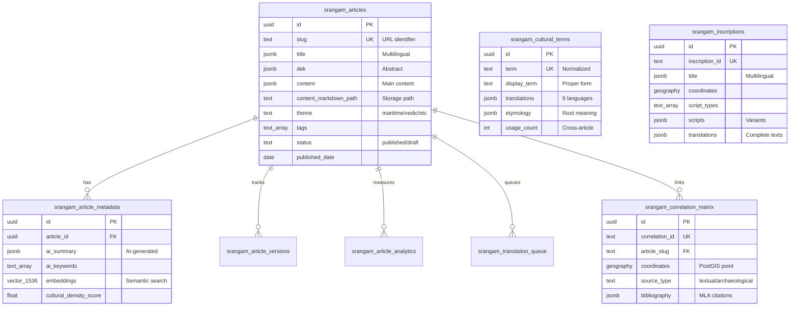

# Srangam Database Schema Documentation

## Overview

Complete database architecture for **Srangam Digital** platform - a scholarly repository for Indian Ocean maritime studies, indigenous knowledge preservation, and civilizational research.

**Backend**: Lovable Cloud (Supabase PostgreSQL)  
**Namespace**: All tables use `srangam_` prefix  
**Extensions**: PostGIS (geography), pgvector (semantic search)

---

## Table Reference

| Table | Purpose | Records | Multilingual |
|-------|---------|---------|--------------|
| [srangam_articles](#srangam_articles) | Core content repository | 30+ articles | ✅ JSONB |
| [srangam_cultural_terms](#srangam_cultural_terms) | Dharmic concepts database | 800+ terms | ✅ JSONB |
| [srangam_correlation_matrix](#srangam_correlation_matrix) | Evidence linking system | 69 correlations | ✅ JSONB |
| [srangam_article_metadata](#srangam_article_metadata) | AI-generated insights | Per article | ✅ JSONB |
| [srangam_article_versions](#srangam_article_versions) | Version control | Historical | ❌ |
| [srangam_article_analytics](#srangam_article_analytics) | Usage tracking | Daily aggregates | ❌ |
| [srangam_translation_queue](#srangam_translation_queue) | Translation workflow | Active tasks | ❌ |
| [srangam_inscriptions](#srangam_inscriptions) | Epigraphy data | Specialized | ✅ JSONB |

---

## Entity Relationship Diagram



---

## Table Schemas

### `srangam_articles`

**Purpose**: Core content repository for all research articles

| Column | Type | Nullable | Default | Description |
|--------|------|----------|---------|-------------|
| `id` | uuid | NO | `gen_random_uuid()` | Primary key |
| `slug` | text | NO | - | URL-safe identifier (unique, original) |
| `slug_alias` | text | YES | - | User-friendly short URL (unique, <50 chars) |
| `title` | jsonb | NO | - | `{en, ta, te, kn, bn, as, pn, hi, pa}` |
| `dek` | jsonb | YES | - | Short abstract (multilingual) |
| `content` | jsonb | NO | - | Main article body (multilingual) |
| `content_markdown_path` | text | YES | - | Path to `.md` file in Storage |
| `author` | text | NO | - | Author name |
| `published_date` | date | NO | `CURRENT_DATE` | Publication date |
| `updated_at` | timestamptz | NO | `now()` | Auto-updated via trigger |
| `created_at` | timestamptz | NO | `now()` | Creation timestamp |
| `theme` | text | NO | - | `maritime`, `sacred-ecology`, `vedic`, etc. |
| `tags` | text[] | YES | `'{}'` | Array of topic tags |
| `read_time_minutes` | integer | YES | - | Estimated reading time |
| `status` | text | NO | `'draft'` | `draft`, `published`, `archived` |
| `featured` | boolean | YES | `false` | Featured article flag |
| `series_id` | uuid | YES | - | For multi-part articles |
| `part_number` | integer | YES | - | Part number in series |

**Indexes**:
- `idx_srangam_articles_slug` on `slug`
- `idx_srangam_articles_slug_alias` on `slug_alias`
- `idx_srangam_articles_theme` on `theme`
- `idx_srangam_articles_status_date` on `(status, published_date DESC)`

**Constraints**:
- `srangam_articles_slug_alias_unique` - Unique constraint on `slug_alias`

**Slug Standardization System**:

The `slug_alias` field provides user-friendly, SEO-optimized URLs while maintaining backward compatibility with original slugs.

**Resolution Priority**:
1. Check `slug_alias` first (e.g., `/oceanic/sacred-tree-harvest-rhythms`)
2. Fallback to original `slug` (e.g., `/oceanic/under-the-sacred-tree-harvest-rhythms-groves-and-sky-time-across-bh-ratavar-a`)

**Benefits**:
- **72% shorter URLs** on average (131 → 27 chars)
- **Better SEO**: Keyword-rich, clean URLs
- **Backward compatible**: Original slugs still work
- **Gradual migration**: Not all articles need aliases

**Current Status** (as of 2025-11-23):
- 12 articles have `slug_alias` populated
- 11 articles pending (Phase 2)
- All 23 database articles accessible via original slug

**Example Mappings**:
```
Original: under-the-sacred-tree-harvest-rhythms-groves-and-sky-time-across-bh-ratavar-a (77 chars)
Alias:    sacred-tree-harvest-rhythms (28 chars)

Original: dashanami-ascetics-n-th-yogis-j-vikas-and-the-sacred-geography-of-jyotirli-gas (78 chars)
Alias:    dashanami-jyotirlinga-geography (31 chars)
```

For complete documentation: [docs/SLUG_STANDARDIZATION.md](./SLUG_STANDARDIZATION.md)

**Triggers**:
- `update_srangam_articles_updated_at` - Auto-update `updated_at` on modification

---

### `srangam_article_metadata`

**Purpose**: AI-generated insights and semantic search embeddings

| Column | Type | Nullable | Default | Description |
|--------|------|----------|---------|-------------|
| `id` | uuid | NO | `gen_random_uuid()` | Primary key |
| `article_id` | uuid | NO | - | FK → `srangam_articles.id` |
| `ai_summary` | jsonb | YES | - | AI-generated summaries (multilingual) |
| `ai_keywords` | text[] | YES | `'{}'` | Extracted topic keywords |
| `ai_themes` | text[] | YES | `'{}'` | Detected thematic categories |
| `cultural_density_score` | float | YES | - | % of cultural terms in content |
| `sentiment_analysis` | jsonb | YES | - | Academic tone metrics |
| `embeddings` | vector(1536) | YES | - | For semantic search |
| `generated_at` | timestamptz | NO | `now()` | Generation timestamp |
| `ai_model_version` | text | YES | - | e.g., `gemini-2.5-pro` |

**Indexes**:
- `idx_srangam_article_metadata_embeddings` - IVFFlat vector index for similarity search

**Related Functions**:
- `srangam_search_articles_semantic(query_embedding, threshold, count)` - Semantic similarity search

---

### `srangam_cultural_terms`

**Purpose**: Database of 800+ dharmic concepts with etymological context

| Column | Type | Nullable | Default | Description |
|--------|------|----------|---------|-------------|
| `id` | uuid | NO | `gen_random_uuid()` | Primary key |
| `term` | text | NO | - | Normalized term (lowercase, unique) |
| `display_term` | text | NO | - | Proper display form |
| `module` | text | NO | - | `core`, `vedic`, `maritime`, etc. |
| `transliteration` | text | YES | - | IAST standard transliteration |
| `translations` | jsonb | NO | - | Definitions in 9 languages |
| `etymology` | jsonb | YES | - | Root meaning (multilingual) |
| `context` | jsonb | YES | - | Cultural explanation (multilingual) |
| `synonyms` | text[] | YES | `'{}'` | Alternative terms |
| `related_terms` | text[] | YES | `'{}'` | Cross-references |
| `usage_count` | integer | YES | `0` | Times used across articles |
| `created_at` | timestamptz | NO | `now()` | Creation timestamp |

**Indexes**:
- `idx_srangam_cultural_terms_term` on `term`
- `idx_srangam_cultural_terms_module` on `module`

**Related Functions**:
- `srangam_increment_term_usage(term_key)` - Increment usage counter

---

### `srangam_correlation_matrix`

**Purpose**: Evidence linking system (69-point correlation matrix)

| Column | Type | Nullable | Default | Description |
|--------|------|----------|---------|-------------|
| `id` | uuid | NO | `gen_random_uuid()` | Primary key |
| `correlation_id` | text | NO | - | e.g., `CM-001` (unique) |
| `article_slug` | text | YES | - | Related article |
| `theme` | text | NO | - | `ancient-india`, `empires-exchange`, etc. |
| `source_type` | text | NO | - | `textual`, `archaeological`, `geographic` |
| `location_ancient` | text | YES | - | Historical place name |
| `location_modern` | text | YES | - | Modern place name |
| `coordinates` | geography(point) | YES | - | PostGIS point |
| `confidence_level` | text | YES | - | `high`, `medium`, `low`, `approximate` |
| `evidence_description` | jsonb | YES | - | Multilingual description |
| `bibliography` | jsonb | YES | - | MLA citation objects |
| `pin_data` | jsonb | YES | - | For map visualization |
| `created_at` | timestamptz | NO | `now()` | Creation timestamp |

**Indexes**:
- `idx_srangam_correlation_coordinates` - GIST index for geographic queries

---

### `srangam_article_versions`

**Purpose**: Version control for content changes

| Column | Type | Nullable | Default | Description |
|--------|------|----------|---------|-------------|
| `id` | uuid | NO | `gen_random_uuid()` | Primary key |
| `article_id` | uuid | NO | - | FK → `srangam_articles.id` |
| `version_number` | integer | NO | - | Incremental version |
| `content_snapshot` | jsonb | NO | - | Full content at version |
| `changed_by` | uuid | YES | - | User who made changes |
| `created_at` | timestamptz | NO | `now()` | Version timestamp |
| `change_summary` | text | YES | - | Summary of changes |

---

### `srangam_article_analytics`

**Purpose**: Usage tracking and performance metrics

| Column | Type | Nullable | Default | Description |
|--------|------|----------|---------|-------------|
| `id` | uuid | NO | `gen_random_uuid()` | Primary key |
| `article_id` | uuid | NO | - | FK → `srangam_articles.id` |
| `date` | date | NO | `CURRENT_DATE` | Analytics date |
| `views` | integer | YES | `0` | Total views |
| `unique_visitors` | integer | YES | `0` | Unique visitor count |
| `avg_read_time_seconds` | integer | YES | `0` | Average read time |
| `completion_rate` | float | YES | `0` | % who read to end |
| `language_breakdown` | jsonb | YES | `'{}'` | `{en: 45, ta: 30, ...}` |
| `cultural_term_interactions` | integer | YES | `0` | Tooltip clicks |
| `updated_at` | timestamptz | NO | `now()` | Last update |

**Indexes**:
- `idx_srangam_analytics_date` on `date DESC`

---

### `srangam_translation_queue`

**Purpose**: Translation workflow management

| Column | Type | Nullable | Default | Description |
|--------|------|----------|---------|-------------|
| `id` | uuid | NO | `gen_random_uuid()` | Primary key |
| `article_id` | uuid | YES | - | FK → `srangam_articles.id` |
| `target_language` | text | NO | - | `ta`, `te`, `kn`, etc. |
| `source_language` | text | NO | `'en'` | Usually `en` |
| `content_type` | text | NO | - | `article`, `cultural_term`, etc. |
| `priority` | text | NO | `'medium'` | `high`, `medium`, `low` |
| `status` | text | NO | `'pending'` | `pending`, `in_progress`, `review`, `completed` |
| `assigned_translator` | text | YES | - | Translator name |
| `due_date` | date | YES | - | Deadline |
| `completed_at` | timestamptz | YES | - | Completion timestamp |
| `created_at` | timestamptz | NO | `now()` | Creation timestamp |

---

### `srangam_inscriptions`

**Purpose**: Specialized epigraphy data (e.g., Ashoka edicts, Brahmic scripts)

| Column | Type | Nullable | Default | Description |
|--------|------|----------|---------|-------------|
| `id` | uuid | NO | `gen_random_uuid()` | Primary key |
| `inscription_id` | text | NO | - | e.g., `kandahar-edict` (unique) |
| `title` | jsonb | NO | - | Multilingual title |
| `location_ancient` | text | NO | - | Historical location |
| `location_modern` | text | NO | - | Modern location |
| `coordinates` | geography(point) | YES | - | PostGIS point |
| `period_dynasty` | text | NO | - | Historical period |
| `period_ruler` | text | YES | - | Ruler name |
| `century` | text | NO | - | e.g., `3rd BCE` |
| `dating_method` | text | YES | - | `paleographic`, `archaeological`, etc. |
| `script_types` | text[] | NO | - | `['brahmic', 'greek', 'aramaic']` |
| `scripts` | jsonb | NO | - | Array of script variants |
| `translations` | jsonb | NO | - | Complete translations (multilingual) |
| `significance` | jsonb | YES | - | Cultural/historical importance |
| `bibliography` | text[] | YES | `'{}'` | Citation array |
| `related_inscriptions` | text[] | YES | `'{}'` | Array of `inscription_id`s |
| `created_at` | timestamptz | NO | `now()` | Creation timestamp |

---

## Row Level Security (RLS) Policies

### Security Strategy

**Public Read, Authenticated Write Model:**
- Published content is publicly accessible (open scholarship)
- Only authenticated users can create/update content
- Versioning tracks all changes

### Policy Implementation

#### `srangam_articles`

```sql
-- Public read published articles
CREATE POLICY "Public read published articles"
  ON srangam_articles FOR SELECT
  USING (status = 'published');

-- Authenticated manage all articles
CREATE POLICY "Authenticated manage articles"
  ON srangam_articles FOR ALL
  USING (auth.uid() IS NOT NULL)
  WITH CHECK (auth.uid() IS NOT NULL);
```

#### `srangam_cultural_terms`

```sql
-- Public read all terms
CREATE POLICY "Public read cultural terms"
  ON srangam_cultural_terms FOR SELECT
  TO public USING (true);

-- Authenticated manage terms
CREATE POLICY "Authenticated manage cultural terms"
  ON srangam_cultural_terms FOR ALL
  USING (auth.uid() IS NOT NULL)
  WITH CHECK (auth.uid() IS NOT NULL);
```

#### `srangam_correlation_matrix`

```sql
-- Public read all correlations
CREATE POLICY "Public read correlation matrix"
  ON srangam_correlation_matrix FOR SELECT
  TO public USING (true);

-- Authenticated manage correlations
CREATE POLICY "Authenticated manage correlations"
  ON srangam_correlation_matrix FOR ALL
  USING (auth.uid() IS NOT NULL)
  WITH CHECK (auth.uid() IS NOT NULL);
```

#### `srangam_article_metadata`

```sql
-- Public read metadata for published articles
CREATE POLICY "Public read article metadata"
  ON srangam_article_metadata FOR SELECT
  USING (
    EXISTS (
      SELECT 1 FROM srangam_articles
      WHERE srangam_articles.id = srangam_article_metadata.article_id
        AND srangam_articles.status = 'published'
    )
  );

-- Authenticated manage metadata
CREATE POLICY "Authenticated manage metadata"
  ON srangam_article_metadata FOR ALL
  USING (auth.uid() IS NOT NULL)
  WITH CHECK (auth.uid() IS NOT NULL);
```

#### `srangam_inscriptions`

```sql
-- Public read all inscriptions
CREATE POLICY "Public read inscriptions"
  ON srangam_inscriptions FOR SELECT
  TO public USING (true);

-- Authenticated manage inscriptions
CREATE POLICY "Authenticated manage inscriptions"
  ON srangam_inscriptions FOR ALL
  USING (auth.uid() IS NOT NULL)
  WITH CHECK (auth.uid() IS NOT NULL);
```

#### Other Tables

```sql
-- Analytics, versions, translation queue: Authenticated only
CREATE POLICY "Authenticated manage analytics"
  ON srangam_article_analytics FOR ALL
  USING (auth.uid() IS NOT NULL)
  WITH CHECK (auth.uid() IS NOT NULL);

CREATE POLICY "Authenticated manage versions"
  ON srangam_article_versions FOR ALL
  USING (auth.uid() IS NOT NULL)
  WITH CHECK (auth.uid() IS NOT NULL);

CREATE POLICY "Authenticated manage translation queue"
  ON srangam_translation_queue FOR ALL
  USING (auth.uid() IS NOT NULL)
  WITH CHECK (auth.uid() IS NOT NULL);
```

---

## Storage Buckets

### `srangam-articles` Bucket

**Configuration:**
- **ID**: `srangam-articles`
- **Public**: Yes (open scholarship)
- **Size Limit**: 10MB per file
- **Allowed MIME Types**: `text/markdown`, `text/plain`, `application/json`

**Directory Structure:**
```
srangam-articles/
├── en/
│   ├── maritime-memories-south-india.md
│   ├── ashoka-kandahar-edicts.md
│   └── ...
├── ta/
│   ├── maritime-memories-south-india.md
│   └── ...
├── te/
│   └── ...
└── metadata/
    └── article-index.json
```

**Storage Policies:**

```sql
-- Public read
CREATE POLICY "Public read markdown articles"
  ON storage.objects FOR SELECT
  USING (bucket_id = 'srangam-articles');

-- Authenticated upload
CREATE POLICY "Authenticated upload articles"
  ON storage.objects FOR INSERT
  WITH CHECK (
    bucket_id = 'srangam-articles' 
    AND auth.uid() IS NOT NULL
  );

-- Authenticated update
CREATE POLICY "Authenticated update articles"
  ON storage.objects FOR UPDATE
  USING (
    bucket_id = 'srangam-articles' 
    AND auth.uid() IS NOT NULL
  );
```

---

## Database Functions

### `srangam_update_updated_at()`

**Purpose**: Auto-update `updated_at` timestamp on record modification

```sql
CREATE OR REPLACE FUNCTION public.srangam_update_updated_at()
RETURNS TRIGGER 
LANGUAGE plpgsql
SECURITY DEFINER
SET search_path = public
AS $$
BEGIN
    NEW.updated_at = NOW();
    RETURN NEW;
END;
$$;

-- Applied to:
CREATE TRIGGER update_srangam_articles_updated_at
  BEFORE UPDATE ON srangam_articles
  FOR EACH ROW EXECUTE FUNCTION srangam_update_updated_at();
```

### `srangam_increment_term_usage(term_key text)`

**Purpose**: Increment usage counter for cultural terms

```sql
CREATE OR REPLACE FUNCTION public.srangam_increment_term_usage(term_key text)
RETURNS void 
LANGUAGE plpgsql 
SECURITY DEFINER
SET search_path = public
AS $$
BEGIN
    UPDATE public.srangam_cultural_terms
    SET usage_count = usage_count + 1
    WHERE term = term_key;
END;
$$;
```

**Usage Example:**
```typescript
await supabase.rpc('srangam_increment_term_usage', { term_key: 'dharmashala' });
```

### `srangam_search_articles_semantic()`

**Purpose**: Semantic similarity search using vector embeddings

```sql
CREATE OR REPLACE FUNCTION public.srangam_search_articles_semantic(
    query_embedding vector(1536),
    match_threshold float DEFAULT 0.7,
    match_count int DEFAULT 5
)
RETURNS TABLE (
    article_id uuid,
    slug text,
    title jsonb,
    similarity float
) 
LANGUAGE plpgsql 
SECURITY DEFINER
SET search_path = public
AS $$
BEGIN
    RETURN QUERY
    SELECT 
        a.id,
        a.slug,
        a.title,
        1 - (m.embeddings <=> query_embedding) as similarity
    FROM public.srangam_articles a
    JOIN public.srangam_article_metadata m ON m.article_id = a.id
    WHERE 
        a.status = 'published' 
        AND m.embeddings IS NOT NULL
        AND 1 - (m.embeddings <=> query_embedding) > match_threshold
    ORDER BY m.embeddings <=> query_embedding
    LIMIT match_count;
END;
$$;
```

**Usage Example:**
```typescript
const { data } = await supabase.rpc('srangam_search_articles_semantic', {
  query_embedding: userQueryVector,
  match_threshold: 0.75,
  match_count: 10
});
```

---

## Query Examples

### Fetch Published Articles by Theme

```typescript
const { data, error } = await supabase
  .from('srangam_articles')
  .select('id, slug, title, dek, published_date, read_time_minutes')
  .eq('status', 'published')
  .eq('theme', 'maritime')
  .order('published_date', { ascending: false })
  .limit(10);
```

### Get Cultural Term with Usage Stats

```typescript
const { data, error } = await supabase
  .from('srangam_cultural_terms')
  .select('display_term, translations, etymology, usage_count')
  .eq('term', 'dharmashala')
  .single();
```

### Find Correlations Near Location

```sql
SELECT 
  correlation_id,
  location_modern,
  confidence_level,
  ST_Distance(
    coordinates::geometry,
    ST_SetSRID(ST_MakePoint(80.2707, 13.0827), 4326)::geometry
  ) AS distance_meters
FROM srangam_correlation_matrix
WHERE ST_DWithin(
  coordinates::geometry,
  ST_SetSRID(ST_MakePoint(80.2707, 13.0827), 4326)::geometry,
  50000  -- 50km radius
)
ORDER BY distance_meters;
```

### Track Daily Article Analytics

```typescript
const { data, error } = await supabase
  .from('srangam_article_analytics')
  .select('date, views, unique_visitors, avg_read_time_seconds')
  .eq('article_id', articleId)
  .gte('date', '2024-01-01')
  .order('date', { ascending: false });
```

---

## Migration History

| Date | Migration | Description |
|------|-----------|-------------|
| 2025-10-27 | `20251027154208_...` | Initial schema: 8 tables, RLS, indexes |
| 2025-10-27 | `20251027154439_...` | Security hardening: function search paths |
| 2025-10-27 | `20251027154551_...` | Additional security fixes |

---

## Performance Considerations

### Indexes

All critical query paths are indexed:
- **Slug lookups**: `idx_srangam_articles_slug`
- **Theme filtering**: `idx_srangam_articles_theme`
- **Date-based queries**: `idx_srangam_articles_status_date`
- **Term lookups**: `idx_srangam_cultural_terms_term`
- **Vector search**: `idx_srangam_article_metadata_embeddings` (IVFFlat)
- **Geographic queries**: `idx_srangam_correlation_coordinates` (GIST)

### Query Optimization

1. **Use prepared statements** for repeated queries
2. **Limit SELECT columns** - avoid `SELECT *`
3. **Use pagination** for large result sets
4. **Leverage JSONB indexing** for multilingual queries
5. **Cache frequently accessed data** (cultural terms, correlations)

---

## Maintenance Guidelines

### Adding New Languages

1. Update JSONB structure in existing records:
```typescript
await supabase
  .from('srangam_articles')
  .update({
    title: {
      ...existingTitle,
      new_lang_code: 'Translated title'
    }
  })
  .eq('id', articleId);
```

2. No schema changes required (JSONB is flexible)

### Backups

- **Automatic**: Lovable Cloud handles daily backups
- **Manual**: Export via Lovable Cloud console
- **Point-in-time recovery**: Available in Lovable Cloud

### Monitoring

- **Query performance**: Check Lovable Cloud dashboard
- **Storage usage**: Monitor `srangam-articles` bucket size
- **RLS policy hits**: Review access patterns

---

## Related Documentation

- [Database Context Guide](./DATABASE_CONTEXT.md)
- [Project Documentation](../SRANGAM_PROJECT.md)
- [Main README](../README.md)
- [Oceanic Bharat System](../OCEANIC_BHARAT_SYSTEM.md)
