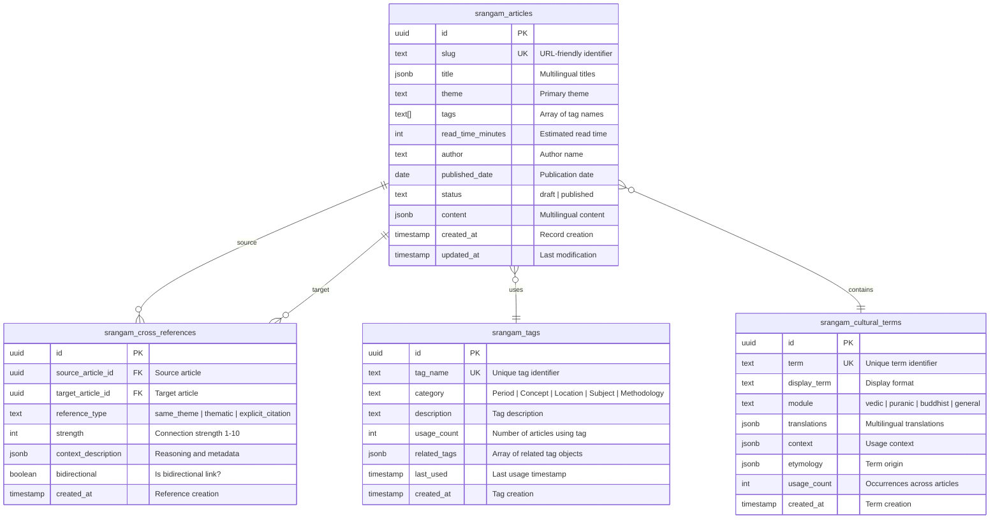

# Database Schema - Admin Tables

## Table of Contents
- [Overview](#overview)
- [Entity-Relationship Diagram](#entity-relationship-diagram)
- [Table Specifications](#table-specifications)
- [Relationships](#relationships)
- [Row Level Security Policies](#row-level-security-policies)
- [Indexes](#indexes)
- [Sample Queries](#sample-queries)

## Overview

The Srangam Admin Dashboard uses 4 primary PostgreSQL tables for managing scholarly content:

| Table | Purpose | Rows (Current) |
|-------|---------|---------------|
| **srangam_articles** | Core article storage | 5 |
| **srangam_tags** | Tag registry with usage tracking | 11 |
| **srangam_cross_references** | Article network edges | 11 |
| **srangam_cultural_terms** | Sanskrit/cultural terminology | 49 |

All tables use UUID primary keys and include timestamp columns for audit trails.

## Entity-Relationship Diagram



## Table Specifications

### srangam_articles

Core table for storing scholarly articles with multilingual content.

**Schema**:
```sql
CREATE TABLE srangam_articles (
  id UUID PRIMARY KEY DEFAULT gen_random_uuid(),
  slug TEXT UNIQUE NOT NULL,
  title JSONB NOT NULL,
  dek JSONB,  -- Subtitle/deck
  content JSONB NOT NULL,
  theme TEXT NOT NULL,
  tags TEXT[] DEFAULT '{}',
  author TEXT NOT NULL,
  published_date DATE NOT NULL DEFAULT CURRENT_DATE,
  status TEXT NOT NULL DEFAULT 'draft',
  read_time_minutes INTEGER,
  featured BOOLEAN DEFAULT false,
  created_at TIMESTAMPTZ NOT NULL DEFAULT now(),
  updated_at TIMESTAMPTZ NOT NULL DEFAULT now()
);
```

**JSONB Structure**:

```typescript
// title field
{
  "en": "Ocean as Archive: Memory and Materiality in the Indian Ocean",
  "ta": "கடல் காப்பகமாக: இந்தியப் பெருங்கடலில் நினைவும் பொருளும்"
}

// content field
{
  "en": "<h2>Introduction</h2><p>This article explores...</p>",
  "ta": "<h2>அறிமுகம்</h2><p>இக்கட்டுரை ஆராய்கிறது...</p>"
}
```

**Sample Row**:
```json
{
  "id": "a1b2c3d4-e5f6-7890-abcd-ef1234567890",
  "slug": "ocean-as-archive",
  "title": {
    "en": "Ocean as Archive: Memory and Materiality in the Indian Ocean"
  },
  "theme": "Ancient India",
  "tags": ["Sanskrit Literature", "Maritime History", "Indian Ocean"],
  "author": "Dr. Ananya Sharma",
  "published_date": "2025-11-09",
  "status": "published",
  "read_time_minutes": 45,
  "created_at": "2025-11-09T12:21:35.123Z",
  "updated_at": "2025-11-09T12:21:35.123Z"
}
```

**Constraints**:
- `slug` must be unique and URL-safe
- `status` must be 'draft' or 'published'
- `theme` required (used for categorization)
- `tags` array can be empty but not null

---

### srangam_tags

Registry of all unique tags with usage analytics.

**Schema**:
```sql
CREATE TABLE srangam_tags (
  id UUID PRIMARY KEY DEFAULT gen_random_uuid(),
  tag_name TEXT UNIQUE NOT NULL,
  category TEXT,
  description TEXT,
  usage_count INTEGER DEFAULT 0,
  related_tags JSONB DEFAULT '[]',
  last_used TIMESTAMPTZ DEFAULT now(),
  created_at TIMESTAMPTZ DEFAULT now()
);
```

**Category Values**:
- `Period`: Historical time periods
- `Concept`: Abstract ideas
- `Location`: Geographic regions
- `Subject`: Academic disciplines
- `Methodology`: Research approaches

**Sample Row**:
```json
{
  "id": "tag-uuid-1234",
  "tag_name": "Sanskrit Literature",
  "category": "Subject",
  "description": "Study of classical Sanskrit texts and literary works",
  "usage_count": 2,
  "related_tags": [
    {"tag": "Puranic Literature", "score": 0.75},
    {"tag": "Literary Criticism", "score": 0.60}
  ],
  "last_used": "2025-11-09T12:21:35.123Z",
  "created_at": "2025-11-08T10:00:00.000Z"
}
```

**Usage Tracking**:
- `usage_count` incremented when tag assigned to article
- `last_used` updated on each assignment
- `related_tags` populated by `analyze-tag-relationships` edge function

---

### srangam_cross_references

Network edges representing relationships between articles.

**Schema**:
```sql
CREATE TABLE srangam_cross_references (
  id UUID PRIMARY KEY DEFAULT gen_random_uuid(),
  source_article_id UUID NOT NULL,
  target_article_id UUID NOT NULL,
  reference_type TEXT NOT NULL,
  strength INTEGER,
  context_description JSONB,
  bidirectional BOOLEAN DEFAULT false,
  created_at TIMESTAMPTZ NOT NULL DEFAULT now(),
  
  CONSTRAINT fk_source FOREIGN KEY (source_article_id) 
    REFERENCES srangam_articles(id) ON DELETE CASCADE,
  CONSTRAINT fk_target FOREIGN KEY (target_article_id) 
    REFERENCES srangam_articles(id) ON DELETE CASCADE
);
```

**Reference Types**:
- `same_theme`: Articles share the same primary theme (90.9% of refs)
- `thematic`: Related themes, conceptual overlap (9.1%)
- `explicit_citation`: Direct citation in article text (0%)
- `methodological`: Shared research methodology

**Strength Scale** (1-10):
- 1-3: Weak connection (tangential)
- 4-6: Medium connection (related content)
- 7-9: Strong connection (highly relevant)
- 10: Critical connection (essential reference)

**Sample Row**:
```json
{
  "id": "ref-uuid-5678",
  "source_article_id": "ocean-as-archive-uuid",
  "target_article_id": "maritime-networks-uuid",
  "reference_type": "same_theme",
  "strength": 7,
  "context_description": {
    "reason": "Both articles explore Indian Ocean connectivity",
    "overlap_tags": ["Maritime History", "Indian Ocean"],
    "calculated_at": "2025-11-09T12:21:35.123Z"
  },
  "bidirectional": false,
  "created_at": "2025-11-09T12:21:35.123Z"
}
```

---

### srangam_cultural_terms

Database of Sanskrit and cultural terminology with translations.

**Schema**:
```sql
CREATE TABLE srangam_cultural_terms (
  id UUID PRIMARY KEY DEFAULT gen_random_uuid(),
  term TEXT UNIQUE NOT NULL,
  display_term TEXT NOT NULL,
  module TEXT NOT NULL,
  transliteration TEXT,
  translations JSONB NOT NULL,
  context JSONB,
  etymology JSONB,
  synonyms TEXT[] DEFAULT '{}',
  related_terms TEXT[] DEFAULT '{}',
  usage_count INTEGER DEFAULT 0,
  created_at TIMESTAMPTZ NOT NULL DEFAULT now()
);
```

**Module Categories**:
- `vedic`: Vedic literature terms
- `puranic`: Puranic texts
- `buddhist`: Buddhist terminology
- `jain`: Jain concepts
- `general`: Unclassified terms (currently all 49 terms)

**Sample Row**:
```json
{
  "id": "term-uuid-9012",
  "term": "dharma",
  "display_term": "Dharma",
  "module": "general",
  "transliteration": "dharma",
  "translations": {
    "en": {
      "translation": "Duty, righteousness, cosmic law",
      "context": "Central concept in Hindu philosophy"
    },
    "ta": {
      "translation": "தர்மம்",
      "context": "இந்து தத்துவத்தின் மைய கருத்து"
    }
  },
  "context": {
    "usage_notes": "Often appears in discussions of ethics and social order"
  },
  "etymology": {
    "root": "dhṛ (to hold, sustain)",
    "meaning": "That which upholds or sustains"
  },
  "usage_count": 3,
  "created_at": "2025-11-08T10:00:00.000Z"
}
```

## Relationships

### Foreign Keys

```sql
-- srangam_cross_references
ALTER TABLE srangam_cross_references
  ADD CONSTRAINT fk_source_article 
  FOREIGN KEY (source_article_id) REFERENCES srangam_articles(id) 
  ON DELETE CASCADE;

ALTER TABLE srangam_cross_references
  ADD CONSTRAINT fk_target_article 
  FOREIGN KEY (target_article_id) REFERENCES srangam_articles(id) 
  ON DELETE CASCADE;
```

**Cascade Behavior**:
- Deleting an article automatically removes all cross-references (source or target)
- Deleting a tag does NOT cascade to articles (tags array is independent)

### Implicit Relationships

- **Articles ↔ Tags**: Many-to-many via `tags` array in `srangam_articles`
- **Articles ↔ Terms**: Many-to-many via regex extraction and `usage_count`

## Row Level Security Policies

### srangam_articles

```sql
-- Public can read published articles
CREATE POLICY "Public read published articles"
ON srangam_articles FOR SELECT
USING (status = 'published');

-- Authenticated users can manage all articles
CREATE POLICY "Authenticated manage articles"
ON srangam_articles FOR ALL
USING (auth.role() = 'authenticated')
WITH CHECK (auth.role() = 'authenticated');
```

### srangam_tags

```sql
-- Everyone can view tags
CREATE POLICY "Tags are viewable by everyone"
ON srangam_tags FOR SELECT
USING (true);

-- Authenticated users can insert tags
CREATE POLICY "Authenticated users can insert tags"
ON srangam_tags FOR INSERT
WITH CHECK (true);

-- Authenticated users can update tags
CREATE POLICY "Authenticated users can update tags"
ON srangam_tags FOR UPDATE
USING (true);
```

### srangam_cross_references

```sql
-- Public can read cross references
CREATE POLICY "Public read cross references"
ON srangam_cross_references FOR SELECT
USING (true);

-- Authenticated users can manage
CREATE POLICY "Authenticated manage cross references"
ON srangam_cross_references FOR ALL
USING (auth.role() = 'authenticated')
WITH CHECK (auth.role() = 'authenticated');
```

### srangam_cultural_terms

```sql
-- Public can read cultural terms
CREATE POLICY "Public read cultural terms"
ON srangam_cultural_terms FOR SELECT
USING (true);

-- Authenticated users can manage
CREATE POLICY "Authenticated manage cultural terms"
ON srangam_cultural_terms FOR ALL
USING (true)
WITH CHECK (true);
```

## Indexes

### Performance Indexes

```sql
-- Article lookups
CREATE INDEX idx_articles_slug ON srangam_articles(slug);
CREATE INDEX idx_articles_theme ON srangam_articles(theme);
CREATE INDEX idx_articles_status ON srangam_articles(status);
CREATE INDEX idx_articles_published_date ON srangam_articles(published_date DESC);

-- Tag queries
CREATE UNIQUE INDEX idx_tags_name ON srangam_tags(tag_name);
CREATE INDEX idx_tags_usage ON srangam_tags(usage_count DESC);
CREATE INDEX idx_tags_category ON srangam_tags(category);

-- Cross-reference network
CREATE INDEX idx_cross_refs_source ON srangam_cross_references(source_article_id);
CREATE INDEX idx_cross_refs_target ON srangam_cross_references(target_article_id);
CREATE INDEX idx_cross_refs_strength ON srangam_cross_references(strength DESC);
CREATE INDEX idx_cross_refs_type ON srangam_cross_references(reference_type);

-- Cultural terms
CREATE UNIQUE INDEX idx_terms_term ON srangam_cultural_terms(term);
CREATE INDEX idx_terms_module ON srangam_cultural_terms(module);
CREATE INDEX idx_terms_usage ON srangam_cultural_terms(usage_count DESC);
```

### JSONB Indexes (Future)

For faster multilingual queries:

```sql
-- Index English titles
CREATE INDEX idx_articles_title_en ON srangam_articles 
  USING GIN ((title->'en'));

-- Index Tamil content
CREATE INDEX idx_articles_content_ta ON srangam_articles 
  USING GIN ((content->'ta'));
```

## Sample Queries

### Get All Articles with Tags

```sql
SELECT 
  id,
  slug,
  title->>'en' as title_en,
  theme,
  tags,
  array_length(tags, 1) as tag_count,
  read_time_minutes,
  created_at
FROM srangam_articles
WHERE status = 'published'
ORDER BY created_at DESC;
```

### Tag Usage Statistics

```sql
SELECT 
  tag_name,
  category,
  usage_count,
  last_used,
  jsonb_array_length(related_tags) as related_count
FROM srangam_tags
ORDER BY usage_count DESC, tag_name
LIMIT 20;
```

### Article Network (Cross-References)

```sql
SELECT 
  sr.reference_type,
  sr.strength,
  sr.context_description->>'reason' as reason,
  sa_source.slug as source_slug,
  sa_source.title->>'en' as source_title,
  sa_target.slug as target_slug,
  sa_target.title->>'en' as target_title,
  sr.created_at
FROM srangam_cross_references sr
JOIN srangam_articles sa_source ON sr.source_article_id = sa_source.id
JOIN srangam_articles sa_target ON sr.target_article_id = sa_target.id
ORDER BY sr.strength DESC, sr.created_at DESC;
```

### Top Cultural Terms

```sql
SELECT 
  display_term,
  translations->>'en' as english_translation,
  module,
  usage_count,
  array_length(related_terms, 1) as related_count
FROM srangam_cultural_terms
ORDER BY usage_count DESC
LIMIT 30;
```

### Articles Without Tags (Needs Re-import)

```sql
SELECT 
  id,
  slug,
  title->>'en' as title,
  theme,
  created_at
FROM srangam_articles
WHERE tags IS NULL OR array_length(tags, 1) = 0
ORDER BY created_at DESC;
```

### Category Distribution

```sql
SELECT 
  category,
  COUNT(*) as tag_count,
  ROUND(COUNT(*) * 100.0 / SUM(COUNT(*)) OVER (), 1) as percentage
FROM srangam_tags
WHERE category IS NOT NULL
GROUP BY category
ORDER BY tag_count DESC;
```
