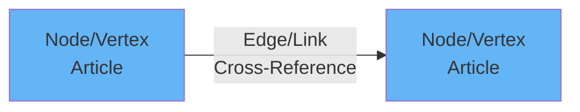
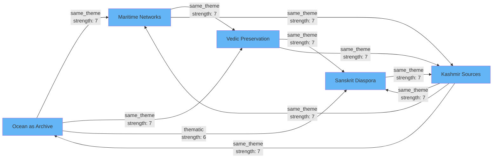
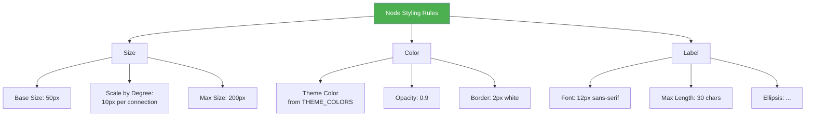
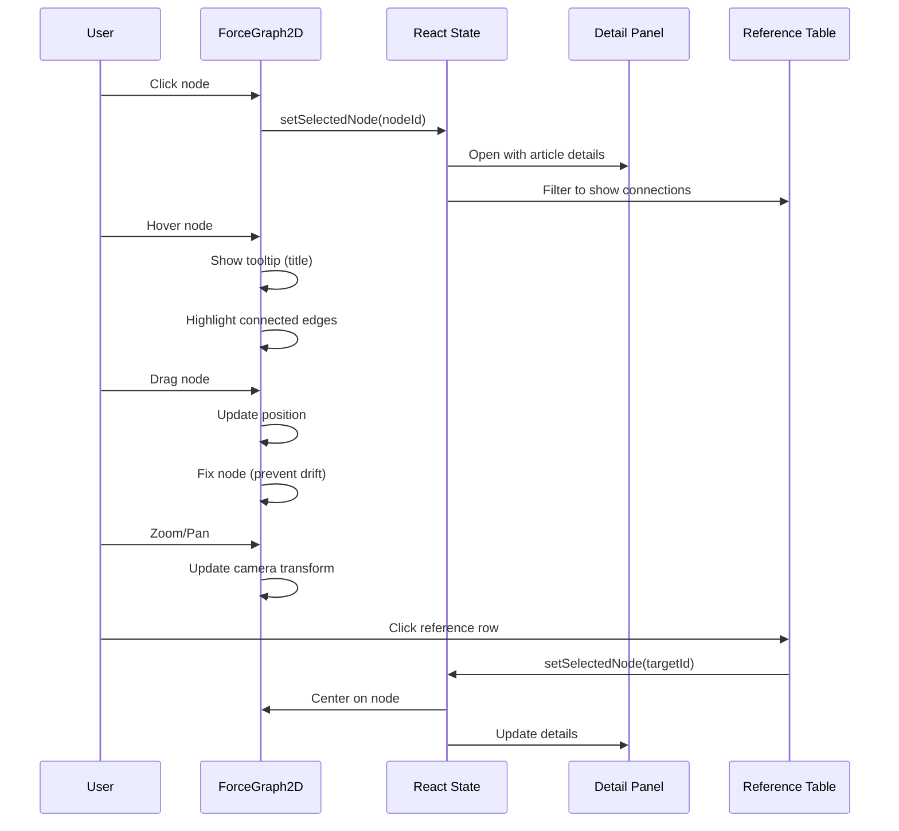

# Network Visualization Guide

## Table of Contents
- [Overview](#overview)
- [Graph Theory Basics](#graph-theory-basics)
- [Cross-Reference Network Structure](#cross-reference-network-structure)
- [Implementation Guide](#implementation-guide)
- [Visual Design](#visual-design)
- [Interaction Patterns](#interaction-patterns)
- [Performance Optimization](#performance-optimization)

## Overview

The Srangam Cross-Reference Browser visualizes the interconnected network of scholarly articles using an interactive force-directed graph. This visualization helps researchers discover thematic relationships and navigate the knowledge base.

### Key Features
- **Interactive Graph**: Drag, zoom, and pan to explore connections
- **Color-Coded Nodes**: Articles colored by theme
- **Weighted Edges**: Link thickness represents connection strength (1-10)
- **Real-Time Filtering**: Filter by reference type and strength
- **Article Details**: Click nodes to view metadata and connections
- **Synced Table**: Reference list table updates with graph selection

### Current Network Statistics
- **Nodes (Articles)**: 5
- **Edges (Cross-References)**: 11
- **Average Degree**: 4.4 connections per article
- **Network Density**: 55% (11 of 20 possible edges)
- **Most Connected Article**: "Ocean as Archive" (4 outgoing refs)

## Graph Theory Basics

### Terminology



| Term | Definition | In Srangam Context |
|------|------------|-------------------|
| **Node (Vertex)** | Individual entity in graph | Scholarly article |
| **Edge (Link)** | Connection between nodes | Cross-reference between articles |
| **Directed Graph** | Edges have direction (A→B) | Source article references target |
| **Weighted Graph** | Edges have numeric values | Strength score 1-10 |
| **Degree** | Number of connections | Total incoming + outgoing refs |

### Graph Metrics

#### Degree Centrality
**Definition**: Number of direct connections a node has

**Formula**: `degree(v) = in-degree(v) + out-degree(v)`

**Example**:
- "Ocean as Archive": 4 outgoing + 3 incoming = **7 total degree**
- High degree = central to the network

#### Clustering Coefficient
**Definition**: How tightly a node's neighbors are connected

**Formula**: `C(v) = 2 * edges_between_neighbors / (degree * (degree - 1))`

**Interpretation**:
- High clustering = forms dense subgraph (thematic cluster)
- Low clustering = bridge between topics

## Cross-Reference Network Structure

### Current Network Topology



### Reference Types

| Type | Count | % | Description | Color |
|------|-------|---|-------------|-------|
| **same_theme** | 10 | 90.9% | Articles share same theme | 🟢 Green |
| **thematic** | 1 | 9.1% | Related but different themes | 🟠 Orange |
| **explicit_citation** | 0 | 0% | Direct citation in text | 🔵 Blue |

### Strength Distribution

| Strength Range | Count | Meaning |
|---------------|-------|---------|
| **1-3** (Weak) | 0 | Tangential connection |
| **4-6** (Medium) | 1 | Related content |
| **7-9** (Strong) | 10 | Highly relevant |
| **10** (Critical) | 0 | Essential reference |

**Average Strength**: 6.91/10

## Implementation Guide

### Technology Stack

- **Library**: `react-force-graph-2d` v1.29.0
- **Physics Engine**: D3-force simulation
- **Canvas Rendering**: HTML5 Canvas (performance)
- **State Management**: React hooks + TanStack Query

### Installation

```bash
npm install react-force-graph-2d
```

### Data Structure

#### Graph Data Format

```typescript
interface GraphData {
  nodes: ArticleNode[];
  links: GraphLink[];
}

interface ArticleNode {
  id: string;              // article UUID
  name: string;            // article title
  val: number;             // node size (connection count)
  color: string;           // theme-based color
  group: string;           // theme name
  slug: string;            // for navigation
  tags: string[];          // for filtering
}

interface GraphLink {
  source: string;          // source article ID
  target: string;          // target article ID
  value: number;           // link thickness (strength 1-10)
  type: string;            // reference_type
  color: string;           // type-based color
  label: string;           // hover tooltip
}
```

#### Data Transformation

```typescript
// Transform articles to nodes
const nodes = articles.map(article => {
  const connectionCount = crossRefs.filter(
    ref => ref.source_article_id === article.id || 
           ref.target_article_id === article.id
  ).length;
  
  return {
    id: article.id,
    name: article.title?.en || article.slug,
    val: connectionCount * 10, // Scale for visibility
    color: getThemeColor(article.theme),
    group: article.theme,
    slug: article.slug,
    tags: article.tags || []
  };
});

// Transform cross-references to links
const links = crossRefs.map(ref => ({
  source: ref.source_article_id,
  target: ref.target_article_id,
  value: ref.strength, // 1-10
  type: ref.reference_type,
  color: getTypeColor(ref.reference_type),
  label: ref.context_description?.reason || ref.reference_type
}));
```

### Basic Implementation

```typescript
import ForceGraph2D from 'react-force-graph-2d';

const CrossReferencesBrowser = () => {
  const graphRef = useRef();
  const [selectedNode, setSelectedNode] = useState(null);
  
  const graphData = useMemo(() => ({
    nodes: transformedNodes,
    links: transformedLinks
  }), [articles, crossRefs]);
  
  return (
    <ForceGraph2D
      ref={graphRef}
      graphData={graphData}
      
      // Node configuration
      nodeLabel="name"
      nodeVal={node => node.val}
      nodeColor={node => node.color}
      nodeCanvasObject={customNodeRenderer}
      
      // Link configuration
      linkWidth={link => link.value}
      linkColor={link => link.color}
      linkDirectionalParticles={2}
      linkDirectionalParticleWidth={2}
      linkLabel={link => link.label}
      
      // Interaction handlers
      onNodeClick={handleNodeClick}
      onNodeHover={handleNodeHover}
      enableNodeDrag={true}
      
      // Physics simulation
      cooldownTicks={100}
      d3AlphaDecay={0.02}
      d3VelocityDecay={0.3}
      
      // Rendering
      backgroundColor="#ffffff"
      width={800}
      height={600}
    />
  );
};
```

## Visual Design

### Color Schemes

#### Node Colors (by Theme)

```typescript
const THEME_COLORS = {
  'Ancient India': '#64B5F6',      // Blue
  'Vedic Studies': '#FFB74D',      // Orange
  'Maritime History': '#81C784',   // Green
  'Sanskrit Literature': '#BA68C8', // Purple
  'Default': '#9E9E9E'             // Grey
};

function getThemeColor(theme: string): string {
  return THEME_COLORS[theme] || THEME_COLORS['Default'];
}
```

#### Link Colors (by Reference Type)

```typescript
const TYPE_COLORS = {
  'same_theme': '#81C784',          // Green (harmony)
  'thematic': '#FFB74D',            // Orange (related)
  'explicit_citation': '#64B5F6',   // Blue (direct)
  'methodological': '#BA68C8'       // Purple (approach)
};
```

### Node Styling



**Custom Node Renderer**:

```typescript
function customNodeRenderer(node, ctx, globalScale) {
  const label = node.name;
  const fontSize = 12 / globalScale;
  ctx.font = `${fontSize}px Sans-Serif`;
  
  // Draw circle
  ctx.beginPath();
  ctx.arc(node.x, node.y, node.val, 0, 2 * Math.PI, false);
  ctx.fillStyle = node.color;
  ctx.fill();
  
  // Draw border
  ctx.strokeStyle = '#ffffff';
  ctx.lineWidth = 2;
  ctx.stroke();
  
  // Draw label
  ctx.textAlign = 'center';
  ctx.textBaseline = 'middle';
  ctx.fillStyle = '#000000';
  ctx.fillText(
    label.length > 30 ? label.substring(0, 27) + '...' : label,
    node.x,
    node.y + node.val + fontSize
  );
}
```

### Link Styling

**Thickness Mapping**:
```typescript
function getLinkWidth(strength: number): number {
  // Map strength (1-10) to pixel width (1-8)
  return Math.max(1, Math.min(8, strength * 0.8));
}
```

**Directional Particles**:
- **Count**: 2 particles per link
- **Speed**: 0.01 (slow drift)
- **Width**: 2px
- **Color**: Matches link color

## Interaction Patterns

### User Interactions



### Click Handlers

```typescript
const handleNodeClick = useCallback((node: ArticleNode) => {
  // 1. Update selected state
  setSelectedNode(node.id);
  
  // 2. Center graph on node
  if (graphRef.current) {
    graphRef.current.centerAt(node.x, node.y, 1000);
    graphRef.current.zoom(2, 1000);
  }
  
  // 3. Open detail panel
  setDetailPanelOpen(true);
  
  // 4. Filter reference table
  const connections = crossRefs.filter(
    ref => ref.source_article_id === node.id || 
           ref.target_article_id === node.id
  );
  setFilteredRefs(connections);
}, [crossRefs]);
```

### Hover Effects

```typescript
const handleNodeHover = useCallback((node: ArticleNode | null) => {
  // Update hover state
  setHoveredNode(node?.id || null);
  
  // Highlight connected edges
  if (node) {
    const connectedLinks = graphData.links.filter(
      link => link.source === node.id || link.target === node.id
    );
    setHighlightedLinks(connectedLinks.map(l => l.id));
  } else {
    setHighlightedLinks([]);
  }
}, [graphData]);
```

### Filtering

```typescript
// Filter by reference type
const filteredGraphData = useMemo(() => {
  const activeTypes = Object.keys(typeFilters).filter(t => typeFilters[t]);
  
  return {
    nodes: graphData.nodes,
    links: graphData.links.filter(link => 
      activeTypes.includes(link.type)
    )
  };
}, [graphData, typeFilters]);

// Filter by strength range
const strengthFilteredData = useMemo(() => ({
  nodes: filteredGraphData.nodes,
  links: filteredGraphData.links.filter(link =>
    link.value >= minStrength && link.value <= maxStrength
  )
}), [filteredGraphData, minStrength, maxStrength]);
```

## Performance Optimization

### Simulation Control

```typescript
// Stop simulation after initial layout
useEffect(() => {
  if (graphRef.current) {
    // Let simulation run for 100 ticks
    setTimeout(() => {
      graphRef.current.d3Force('charge').strength(0);
    }, 3000);
  }
}, []);
```

### Canvas vs SVG Rendering

| Mode | Nodes | Performance | Features |
|------|-------|-------------|----------|
| **Canvas** (Used) | <1000 | Excellent | Custom rendering |
| **SVG** | <100 | Good | DOM manipulation |

**Rationale**: Canvas rendering for better performance with potential growth to 100+ articles.

### Lazy Loading

```typescript
// Only render graph when tab is active
const { data: crossRefs } = useQuery({
  queryKey: ['cross-references'],
  queryFn: fetchCrossRefs,
  enabled: activeTab === 'network' // Only fetch when needed
});
```

### Memoization

```typescript
// Memoize expensive transformations
const graphData = useMemo(() => 
  transformToGraphData(articles, crossRefs),
  [articles, crossRefs]
);

// Memoize color functions
const getThemeColor = useMemo(() => 
  memoize((theme: string) => THEME_COLORS[theme] || '#9E9E9E'),
  []
);
```

## Future Enhancements

### Clustering Algorithms

Implement automatic clustering for large networks:

```typescript
// K-means clustering by theme
const clusters = clusterByTheme(articles);

// Community detection (Louvain algorithm)
const communities = detectCommunities(graphData);
```

### Advanced Filtering

- **Multi-select tags**: Show only articles with selected tags
- **Time range**: Filter by publication date
- **Author**: Filter by author name
- **Strength threshold**: Hide weak connections

### 3D Visualization

For very large networks (>100 nodes), consider upgrading to `react-force-graph-3d`:

```typescript
import ForceGraph3D from 'react-force-graph-3d';

<ForceGraph3D
  graphData={graphData}
  nodeThreeObject={customNode3D}
  linkThreeObject={customLink3D}
/>
```

### Network Analysis Tools

- **Shortest Path**: Find connection path between two articles
- **Centrality Metrics**: Identify most influential articles
- **Subgraph Extraction**: Export thematic clusters
- **Temporal Evolution**: Animate network growth over time
