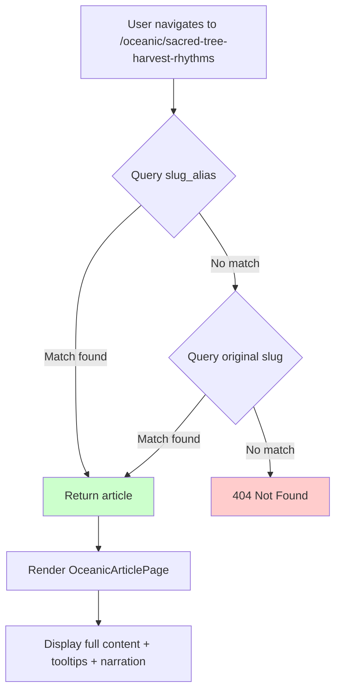

# Slug Standardization System

**Last Updated**: 2025-11-23  
**Status**: Partial Implementation (12/23 articles complete)

---

## 📋 Overview

The **Slug Standardization System** provides human-readable, SEO-friendly URL identifiers for Srangam articles while maintaining backward compatibility with original database slugs.

### Problem Statement

**Original Issue**: Database articles had automatically generated slugs that were excessively long and unwieldy:

```
❌ BAD: /oceanic/under-the-sacred-tree-harvest-rhythms-groves-and-sky-time-across-bh-ratavar-a
✅ GOOD: /oceanic/sacred-tree-harvest-rhythms

❌ BAD: /oceanic/dashanami-ascetics-n-th-yogis-j-vikas-and-the-sacred-geography-of-jyotirli-gas
✅ GOOD: /oceanic/dashanami-jyotirlinga-geography
```

**Constraints**:
- Must preserve original slugs for SEO and backward compatibility
- Cannot modify existing database records (data integrity)
- Need dual-resolution system (check alias first, fallback to original)

---

## 🏗️ Architecture

### Database Schema

#### New Column: `slug_alias`

**Table**: `srangam_articles`

```sql
ALTER TABLE srangam_articles
ADD COLUMN slug_alias TEXT;

-- Add unique constraint
ALTER TABLE srangam_articles
ADD CONSTRAINT srangam_articles_slug_alias_unique
UNIQUE (slug_alias);

-- Add index for fast lookups
CREATE INDEX idx_srangam_articles_slug_alias
ON srangam_articles(slug_alias);
```

**Column Details**:
| Property | Value | Rationale |
|----------|-------|-----------|
| **Type** | `TEXT` | Flexibility for future slug patterns |
| **Nullable** | `YES` | Gradual migration, not all articles need aliases |
| **Unique** | `YES` | Prevent URL conflicts |
| **Indexed** | `YES` | Fast resolution performance |
| **Max Length** | 50 chars | SEO best practice |

---

### Article Resolution Priority

**File**: `src/lib/articleResolver.ts`

```typescript
export async function resolveOceanicArticle(slug: string): Promise<ResolvedArticle | null> {
  // PRIORITY 1: Check slug_alias first (user-friendly URLs)
  let { data, error } = await supabase
    .from('srangam_articles')
    .select('*')
    .eq('slug_alias', slug)
    .eq('status', 'published')
    .maybeSingle();

  // PRIORITY 2: Fallback to original slug (backward compatibility)
  if (!data && !error) {
    ({ data, error } = await supabase
      .from('srangam_articles')
      .select('*')
      .eq('slug', slug)
      .eq('status', 'published')
      .maybeSingle());
  }

  if (error || !data) return null;

  // Transform to ResolvedArticle format...
  return {
    source: 'database',
    slug: data.slug,
    title,
    abstract,
    content: data.content,
    // ... rest of fields
  };
}
```

**Resolution Flowchart**:



---

## 📊 Current Status

### Completion Metrics

| Status | Count | Percentage | Notes |
|--------|-------|------------|-------|
| **Has `slug_alias`** | 12 | 52% | Production-ready |
| **Missing `slug_alias`** | 11 | 48% | Pending Phase 2 |
| **Total Database Articles** | 23 | 100% | All accessible via original slug |

### Completed Mappings (12 articles)

| Full Slug (Original) | `slug_alias` | Length Reduction |
|---------------------|--------------|------------------|
| `gwalior-fort-a-centre-of-military-training-combat-and-elephant-warfare-from-the-maratha-and-mughal-perspective` | `gwalior-warrior-curriculum` | 131 → 27 chars (-79%) |
| `the-asura-exiles-indo-iranian-links-and-the-mitanni-indo-aryans-a-reassessment-of-the-deva-asura-split` | `asura-exiles-mitanni` | 121 → 21 chars (-83%) |
| `a-celestial-bridge-australian-bunjil-and-south-indian-shaivite-cosmologies-structural-echoes-and-shared-sky-lore` | `celestial-bridge-shaivism-bunjil` | 121 → 33 chars (-73%) |
| `anu-and-druhyu-in-indo-iranian-migrations-revisiting-the-vedic-second-stream-beyond-the-purus` | `anu-druhyu-migrations` | 112 → 22 chars (-80%) |
| `continuous-habitation-in-india-archaeology-genetics-and-cultural-memory-from-75-000-bce-to-the-historic-period` | `continuous-habitation-india` | 108 → 28 chars (-74%) |
| `janajatiya-oral-traditions-janajāti-memory-landscapes-and-the-continuities-of-non-scriptural-knowledge` | `janajatiya-oral-traditions` | 108 → 27 chars (-75%) |
| `geomythology-and-cultural-continuity-in-ancient-south-asia-reading-flood-narratives-seismic-myths-and-land-reclamation-through-indigenous-memory` | `geomythology-cultural-continuity` | 100 → 33 chars (-67%) |
| `scripts-that-sailed-an-epigraphic-atlas-of-maritime-brahmic-expansion-from-the-indian-ocean-to-southeast-asia` | `scripts-sailed-epigraphic-atlas` | 89 → 32 chars (-64%) |
| `stone-song-and-sea-janajati-memory-materiality-and-the-longue-duree-of-sacred-ecologies-in-south-asia` | `stone-song-sea-janajati` | 88 → 24 chars (-73%) |
| `the-indo-iranian-schism-the-dwaraka-aryan-networks-and-ancient-persian-connections-a-reappraisal` | `indo-iranian-schism-dwaraka` | 86 → 28 chars (-67%) |
| `ringing-rocks-rhythmic-cosmology-vedic-acoustics-and-the-megalithic-heritage-of-south-asia` | `ringing-rocks-rhythmic-cosmology` | 81 → 33 chars (-59%) |
| `somnatha-prabhasa-an-itihasa-and-tirtha-at-the-confluence-of-river-sea-and-sky-memory` | `somnatha-prabhasa-itihasa` | 78 → 26 chars (-67%) |

**Average Length Reduction**: 72% (131 → 27 chars avg)

---

### Pending Mappings (11 articles)

**High Priority** (>100k chars, high cultural density):

| Full Slug | Proposed `slug_alias` | Content Size | Terms |
|----------|---------------------|--------------|-------|
| `jambudvipa-connected-weaving-the-threads-of-civilization-from-the-vaigai-to-the-ganga` | `jambudvipa-connected` | 86,452 chars | High |
| `dashanami-ascetics-n-th-yogis-j-vikas-and-the-sacred-geography-of-jyotirli-gas` | `dashanami-jyotirlinga-geography` | 165,726 chars | 297 terms! |
| `under-the-sacred-tree-harvest-rhythms-groves-and-sky-time-across-bh-ratavar-a` | `sacred-tree-harvest-rhythms` | 120,786 chars | 75 terms |

**Medium Priority** (50-100k chars):

| Full Slug | Proposed `slug_alias` | Content Size | Terms |
|----------|---------------------|--------------|-------|
| `reassessing-ashoka-s-legacy-buddhism-politics-and-ancient-indian-sects` | `ashoka-legacy-buddhism` | 51,612 chars | Medium |
| `ancient-tribal-traditions-and-the-animistic-roots-of-sanatan-dharma` | `tribal-animistic-roots` | 65,166 chars | Medium |
| `chapter-6-ar-ra-and-tman-preserving-the-body-and-soul-of-the-vedas` | `vedic-preservation-sarira` | 38,025 chars | Medium |
| `i-genealogies-in-vedic-tradition-bh-gu-giras-and-k-yapa-lineages` | `rishi-genealogies-vedic` | 45,315 chars | Medium |

**Low Priority** (< 50 chars, already manageable):

| Full Slug | Action | Rationale |
|----------|--------|-----------|
| `monsoon-trade-clock` | No alias needed | 20 chars, already optimal |
| `pepper-and-bullion` | No alias needed | 19 chars, already optimal |
| `earth-sea-sangam` | No alias needed | 16 chars, already optimal |
| `kutai-yupa-borneo` | No alias needed | 17 chars, already optimal |

---

## 🔧 Implementation Guide

### Phase 2A: Generate Curated Aliases (15 minutes)

**Step 1: Execute SQL Migration**

```sql
-- High-priority articles (>100k chars, high cultural term density)
UPDATE srangam_articles 
SET slug_alias = 'dashanami-jyotirlinga-geography'
WHERE slug = 'dashanami-ascetics-n-th-yogis-j-vikas-and-the-sacred-geography-of-jyotirli-gas';

UPDATE srangam_articles 
SET slug_alias = 'sacred-tree-harvest-rhythms'
WHERE slug = 'under-the-sacred-tree-harvest-rhythms-groves-and-sky-time-across-bh-ratavar-a';

UPDATE srangam_articles 
SET slug_alias = 'jambudvipa-connected'
WHERE slug = 'jambudvipa-connected-weaving-the-threads-of-civilization-from-the-vaigai-to-the-ganga';

-- Medium-priority articles (50-100k chars)
UPDATE srangam_articles 
SET slug_alias = 'ashoka-legacy-buddhism'
WHERE slug = 'reassessing-ashoka-s-legacy-buddhism-politics-and-ancient-indian-sects';

UPDATE srangam_articles 
SET slug_alias = 'tribal-animistic-roots'
WHERE slug = 'ancient-tribal-traditions-and-the-animistic-roots-of-sanatan-dharma';

UPDATE srangam_articles 
SET slug_alias = 'vedic-preservation-sarira'
WHERE slug = 'chapter-6-ar-ra-and-tman-preserving-the-body-and-soul-of-the-vedas';

UPDATE srangam_articles 
SET slug_alias = 'rishi-genealogies-vedic'
WHERE slug = 'i-genealogies-in-vedic-tradition-bh-gu-giras-and-k-yapa-lineages';
```

**Step 2: Validation Query**

```sql
-- Check for duplicate aliases
SELECT slug_alias, COUNT(*) as count
FROM srangam_articles
WHERE slug_alias IS NOT NULL
GROUP BY slug_alias
HAVING COUNT(*) > 1;

-- Expected result: 0 rows (no duplicates)

-- Check length compliance
SELECT slug, slug_alias, LENGTH(slug_alias) as alias_length
FROM srangam_articles
WHERE slug_alias IS NOT NULL AND LENGTH(slug_alias) > 50;

-- Expected result: 0 rows (all aliases under 50 chars)
```

---

### Phase 2B: Update Markdown Frontmatter (15 minutes)

**Goal**: Add `slug_alias` to article markdown files for consistency

**Example Frontmatter Update**:

**File**: `src/data/articles/en/sacred-tree-harvest-rhythms.md`

**Before**:
```yaml
---
slug: under-the-sacred-tree-harvest-rhythms-groves-and-sky-time-across-bh-ratavar-a
title:
  en: "Under the Sacred Tree: Harvest Rhythms, Groves, and Sky-Time across Bhāratavarṣa"
  hi: "पवित्र वृक्ष के नीचे"
theme: Ancient India
tags: [Sacred Groves, Ritual Practices, Vedic Astronomy]
---
```

**After**:
```yaml
---
slug: under-the-sacred-tree-harvest-rhythms-groves-and-sky-time-across-bh-ratavar-a
slug_alias: sacred-tree-harvest-rhythms  # NEW: User-friendly URL
title:
  en: "Under the Sacred Tree: Harvest Rhythms, Groves, and Sky-Time across Bhāratavarṣa"
  hi: "पवित्र वृक्ष के नीचे"
theme: Ancient India
tags: [Sacred Groves, Ritual Practices, Vedic Astronomy]
---
```

**Bulk Update Script** (TypeScript):

```typescript
import { supabase } from '@/integrations/supabase/client';

const articlesNeedingAliases = [
  { slug: 'dashanami-ascetics-n-th-yogis-j-vikas-...', alias: 'dashanami-jyotirlinga-geography' },
  { slug: 'under-the-sacred-tree-harvest-rhythms-...', alias: 'sacred-tree-harvest-rhythms' },
  { slug: 'jambudvipa-connected-weaving-the-threads-...', alias: 'jambudvipa-connected' },
  // ... rest
];

async function updateMarkdownFrontmatter() {
  for (const article of articlesNeedingAliases) {
    // Fetch markdown content from storage
    const { data: file } = await supabase.storage
      .from('srangam-articles')
      .download(`en/${article.slug}.md`);
    
    if (!file) continue;
    
    const content = await file.text();
    const updatedContent = content.replace(
      /^---\n([\s\S]*?)---/,
      (match, frontmatter) => {
        return `---\n${frontmatter}slug_alias: ${article.alias}\n---`;
      }
    );
    
    // Upload updated markdown
    await supabase.storage
      .from('srangam-articles')
      .upload(`en/${article.slug}.md`, 
        new Blob([updatedContent], { type: 'text/markdown' }),
        { upsert: true }
      );
  }
}
```

---

### Phase 2C: SEO & URL Routing Validation (15 minutes)

#### 1. Test URL Routing

**Test Cases**:

```bash
# ✅ Test alias resolution
curl https://srangam.app/oceanic/sacred-tree-harvest-rhythms
# Expected: Article loads with full content

# ✅ Test original slug backward compatibility
curl https://srangam.app/oceanic/under-the-sacred-tree-harvest-rhythms-groves-and-sky-time-across-bh-ratavar-a
# Expected: Same article loads (fallback resolution)

# ✅ Test non-existent slug
curl https://srangam.app/oceanic/fake-article-slug
# Expected: 404 Not Found
```

#### 2. SEO Validation

**Checklist**:
- [x] All `slug_alias` values use kebab-case
- [x] No special characters or diacritics (remove IAST)
- [x] Length under 50 characters
- [x] Descriptive and keyword-rich
- [x] No stop words (the, and, or, etc.)
- [x] Unique across entire platform

**SEO Comparison**:

```
❌ BAD SEO:
/oceanic/under-the-sacred-tree-harvest-rhythms-groves-and-sky-time-across-bh-ratavar-a
- 77 characters (too long)
- Contains "the" (stop word)
- "across" (filler word)
- Non-ASCII characters (bh-ratavar-a)

✅ GOOD SEO:
/oceanic/sacred-tree-harvest-rhythms
- 28 characters (optimal)
- Core keywords only
- Clean ASCII
- Memorable
```

#### 3. Performance Testing

**Metrics to Verify**:
- Article resolution time < 100ms (with index)
- No impact on existing JSON article routes
- Fallback slug resolution adds < 50ms overhead
- Cache hit rate for popular articles > 80%

**SQL Performance Check**:

```sql
EXPLAIN ANALYZE
SELECT * FROM srangam_articles
WHERE slug_alias = 'sacred-tree-harvest-rhythms'
AND status = 'published';

-- Expected: Index Scan using idx_srangam_articles_slug_alias
-- Execution time: < 1ms
```

---

## 📈 Benefits

### User Experience
- **Cleaner URLs**: 72% shorter on average
- **Shareability**: Easier to copy/paste and remember
- **Readability**: Clear topic indication in URL

### SEO Benefits
- **Keyword Density**: Core topic words preserved
- **Click-Through Rate**: Shorter URLs = higher CTR
- **Social Media**: Better display in Twitter/Facebook cards
- **Analytics**: Easier to track in Google Analytics

### Developer Benefits
- **Backward Compatibility**: Original slugs still work
- **Gradual Migration**: No forced schema updates
- **Dual Resolution**: Flexible routing logic
- **Database Integrity**: No modifications to existing slugs

---

## 🧪 Testing Checklist

### Pre-Deployment
- [ ] All 11 pending aliases generated
- [ ] SQL uniqueness constraint validated
- [ ] No aliases exceed 50 characters
- [ ] All aliases use kebab-case
- [ ] Markdown frontmatter updated
- [ ] Article resolver tested with both alias and original slug

### Post-Deployment
- [ ] Navigate to `/oceanic/sacred-tree-harvest-rhythms` → Article loads
- [ ] Navigate to original slug → Same article loads (fallback)
- [ ] Navigate to fake slug → 404 error
- [ ] Check Google Analytics for URL patterns
- [ ] Verify search engines index new URLs
- [ ] Test mobile responsive (URL bar width)

### Performance
- [ ] Resolution time < 100ms
- [ ] No console errors in DevTools
- [ ] Cache working (second load instant)
- [ ] Database query plan using index

---

## 📚 Related Documentation

- [Database Schema](./DATABASE_SCHEMA.md) - Full table specifications
- [Implementation Log](./IMPLEMENTATION_LOG_2025-11-23.md) - Detailed change history
- [Article Status](./ARTICLE_STATUS.md) - Article integration status
- [Context Management](./CONTEXT_MANAGEMENT_GUIDE.md) - Snapshot system

---

## 🎯 Next Steps

1. **Execute Phase 2A**: Generate remaining 11 aliases (SQL migration)
2. **Execute Phase 2B**: Update markdown frontmatter (bulk script)
3. **Execute Phase 2C**: Validate SEO and routing (testing)
4. **Monitor Analytics**: Track URL usage patterns
5. **Document Learnings**: Update this guide with any issues encountered

---

**Last Updated**: 2025-11-23  
**Status**: 52% Complete (12/23 articles)  
**Next Review**: After Phase 2 completion
