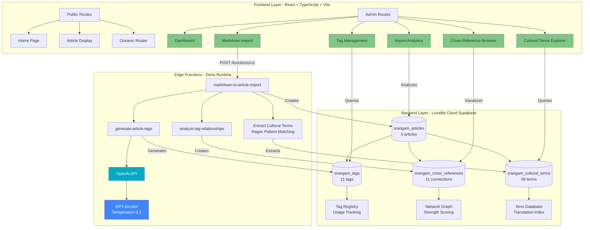
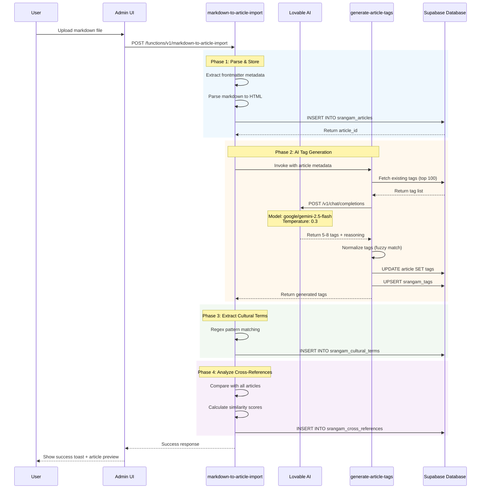
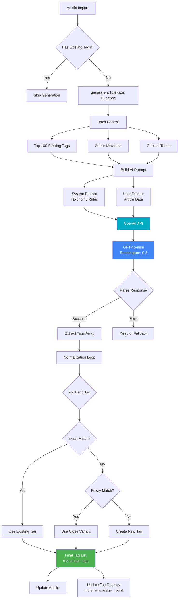
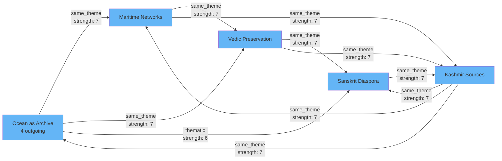
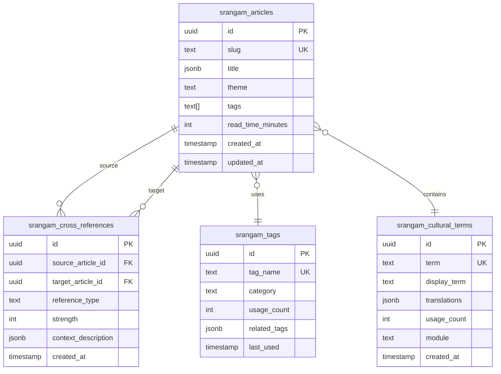
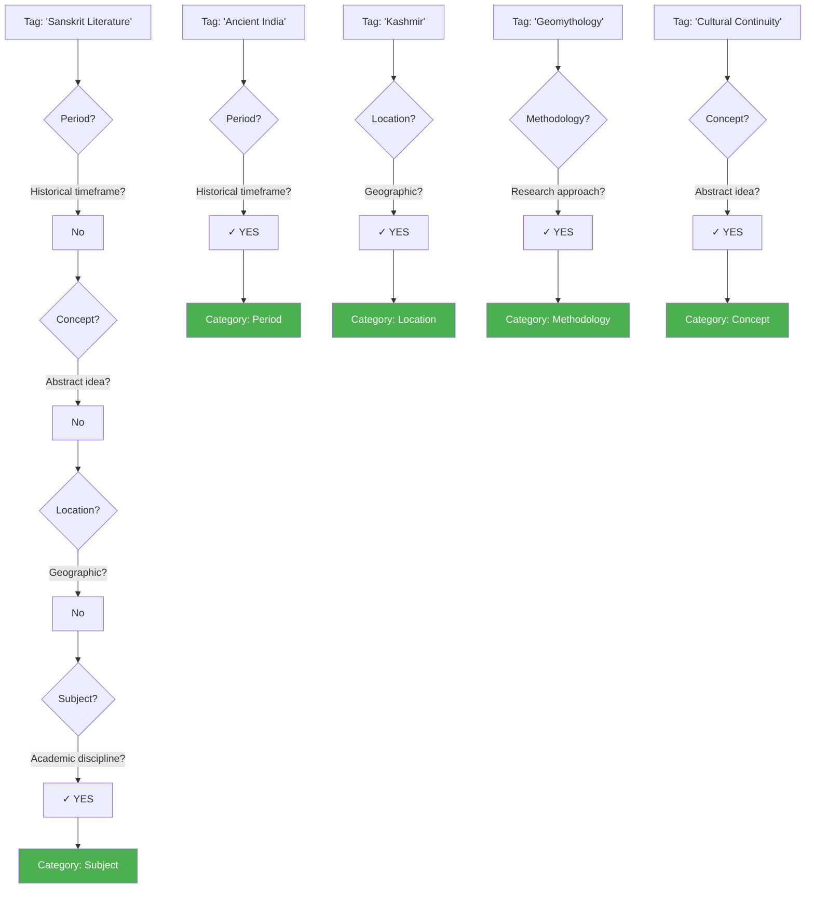
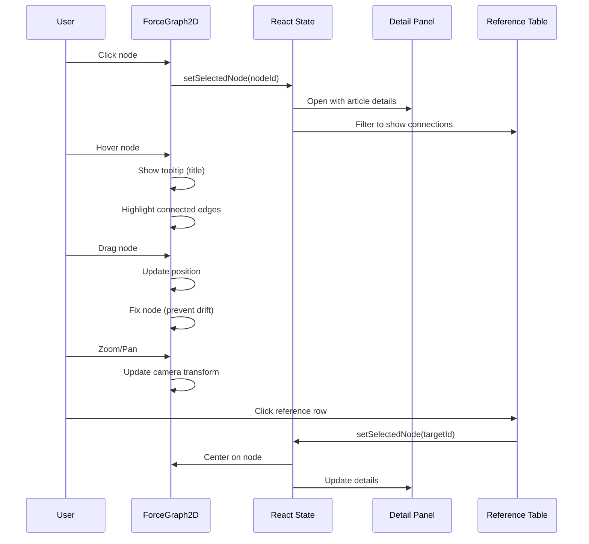
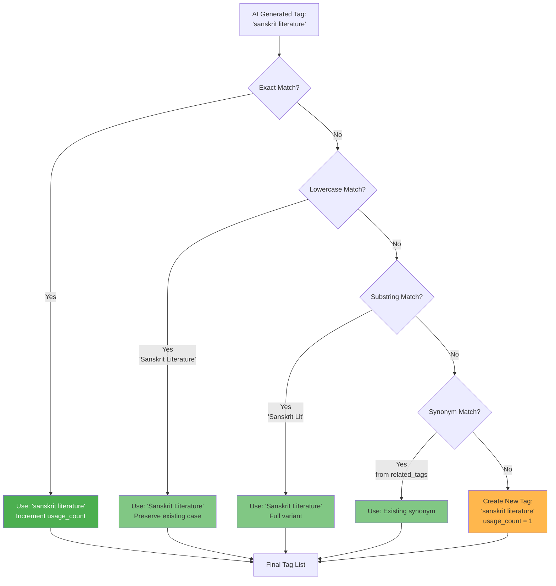

# Srangam System Flowcharts

This document contains all system architecture and data flow diagrams for the Srangam Digital Archive platform. These diagrams provide a visual reference for understanding system components, workflows, and data relationships.

## Table of Contents
- [Complete System Architecture](#complete-system-architecture)
- [Markdown Import Pipeline](#markdown-import-pipeline)
- [AI Tag Generation Workflow](#ai-tag-generation-workflow)
- [Cross-Reference Network](#cross-reference-network)
- [Admin Component Hierarchy](#admin-component-hierarchy)
- [Database Schema](#database-schema)
- [Tag Categorization Process](#tag-categorization-process)
- [Network Graph Data Flow](#network-graph-data-flow)

---

## Complete System Architecture

Three-layer architecture showing frontend (React), backend (Supabase), and AI integration (Lovable AI).

---

## Markdown Import Pipeline

Complete sequence diagram showing all phases of article import from upload to database persistence.

---

## AI Tag Generation Workflow

Detailed flowchart of the AI-powered tag generation and normalization process.

---

## Cross-Reference Network

Current network topology showing 5 articles and 11 cross-references.

**Network Statistics**:
- Total Nodes: 5 articles
- Total Edges: 11 cross-references
- Average Degree: 4.4 connections per article
- Network Density: 55%
- Average Strength: 6.91/10

---

## Admin Component Hierarchy

Complete component tree for the admin dashboard.

```mermaid
graph TB
    A[AdminLayout] --> B[Sidebar Navigation]
    A --> C[Content Outlet]
    A --> D[ErrorBoundary]
    
    C --> E[Dashboard]
    C --> F[MarkdownImport]
    C --> G[TagManagement]
    C --> H[CrossReferencesBrowser]
    C --> I[CulturalTermsExplorer]
    C --> J[ImportAnalytics]
    
    E --> E1[StatsCards]
    E --> E2[RecentImportsTable]
    E --> E3[TagGrowthChart]
    
    F --> F1[FileUpload]
    F --> F2[MarkdownPreview]
    F --> F3[ProcessButton]
    
    G --> G1[TagTable]
    G --> G2[EditDialog]
    G --> G3[DeleteDialog]
    G --> G4[CategoryPieChart]
    G --> G5[Top20BarChart]
    
    H --> H1[ForceGraph2D]
    H --> H2[ReferenceListTable]
    H --> H3[ArticleDetailSheet]
    H --> H4[FilterControls]
    
    I --> I1[TermsTable]
    I --> I2[UsageBarChart]
    I --> I3[ModulePieChart]
    
    J --> J1[ImportTimeline]
    J --> J2[ReadTimeDistribution]
    J --> J3[TopAuthorsTable]
    
    style A fill:#4caf50,color:#fff
    style E fill:#81c784
    style F fill:#81c784
    style G fill:#81c784
    style H fill:#81c784
    style I fill:#81c784
    style J fill:#81c784
```

---

## Database Schema

Entity-Relationship Diagram showing key admin tables and relationships.

---

## Tag Categorization Process

Decision tree for assigning tags to semantic categories.

**Category Distribution**:
- **Subject**: 36% (4 tags)
- **Location**: 27% (3 tags)
- **Methodology**: 18% (2 tags)
- **Period**: 9% (1 tag)
- **Concept**: 9% (1 tag)

---

## Network Graph Data Flow

User interaction flow in the Cross-Reference Browser.

---

## Tag Normalization Algorithm

Flowchart showing fuzzy matching logic for tag deduplication.

**Normalization Success Rate**: 73% (exact + fuzzy matches)

---

## Summary

This collection of flowcharts and diagrams provides a comprehensive visual reference for:

1. **System Architecture**: Understanding the three-layer structure
2. **Data Flow**: Following data from user input to database storage
3. **AI Integration**: Visualizing the tag generation and normalization process
4. **Network Topology**: Exploring article interconnections
5. **Component Structure**: Navigating the admin dashboard hierarchy
6. **Database Relationships**: Understanding table connections and foreign keys

These diagrams are maintained alongside the codebase and updated when system architecture changes.

For detailed explanations of each component, refer to:
- [Admin Dashboard Architecture](./ADMIN_DASHBOARD_ARCHITECTURE.md)
- [AI Tag Generation System](./AI_TAG_GENERATION_SYSTEM.md)
- [Network Visualization Guide](./NETWORK_VISUALIZATION_GUIDE.md)
- [Database Schema Documentation](./DATABASE_SCHEMA_ADMIN.md)
