# Cross-Reference System Architecture

This document describes the automatic cross-reference detection and relationship management system for Srangam articles.

## Database Schema


## Reference Types


**Currently Implemented:**
- ✅ **thematic**: Tag similarity (2+ shared tags)
- ✅ **same_theme**: Exact theme match
- ✅ **explicit_citation**: `(see: article-slug)` pattern

**Future Implementation:**
- 🔜 **temporal**: Articles covering same time period
- 🔜 **geographical**: Articles about same region
- 🔜 **author_network**: Same author or research team

## Detection Algorithm

### Tag Similarity Scoring

```mermaid
flowchart TD
    A[Compare Tags] --> B{Count Shared Tags}
    B --> C{Shared >= 2?}
    C -->|Yes| D[Calculate Strength]
    C -->|No| E[Skip]
    D --> F[Strength = min 10, count × 2]
    F --> G[Create Reference]
    
    style A fill:#e1f5ff
    style G fill:#d4edda
    style E fill:#f8d7da
```



**Algorithm:**
```typescript
const sharedTags = articleTags.filter(tag => otherTags.includes(tag));
if (sharedTags.length >= 2) {
  const strength = Math.min(10, sharedTags.length * 2);
  // Create cross-reference
}
```

### Theme Matching


### Explicit Citation Detection


**Pattern:** `/\(see:?\s+([a-z0-9-]+)\)/gi`

**Examples:**
- `(see: vedic-ritual-reciprocity)`
- `(See: har-har-hari-hari)`
- `(see also: ancient-india-timeline)`

## Strength Scale


**Strength Guidelines:**
- **10**: Explicit citation (manually linked)
- **7-9**: Same theme or 4+ shared tags
- **4-6**: 2-3 shared tags
- **1-3**: Weak similarity (future: AI embeddings)

## Bidirectional vs Unidirectional


**Bidirectional** (automatic reverse link):
- Tag similarity
- Same theme
- Temporal/geographical clustering

**Unidirectional** (one-way reference):
- Explicit citations
- "See also" suggestions
- User-curated recommendations

## Context Metadata

Each cross-reference includes a `context_description` JSONB field:

```json
{
  "sharedTags": ["vedic", "ritual", "reciprocity"],
  "reason": "Shares 3 topic tags: vedic, ritual, reciprocity",
  "detectedAt": "2025-11-09T14:23:45Z",
  "detectionMethod": "tag_similarity"
}
```

**Fields:**
- `sharedTags`: Array of overlapping tags
- `theme`: Common theme identifier
- `citationText`: Original citation pattern
- `reason`: Human-readable explanation
- `detectedAt`: ISO timestamp
- `detectionMethod`: Algorithm identifier

## Network Visualization


## UI Component Flow


## Performance Optimization

### Indexing Strategy

```sql
-- Composite index for fast cross-reference lookups
CREATE INDEX idx_xref_source_strength 
ON srangam_cross_references(source_article_id, strength DESC);

-- GIN index for tag similarity
CREATE INDEX idx_articles_tags 
ON srangam_articles USING GIN(tags);

-- B-tree index for theme filtering
CREATE INDEX idx_articles_theme 
ON srangam_articles(theme, status);
```

### Query Optimization

```sql
-- Efficient cross-reference query with JOIN
SELECT 
  sr.*,
  sa.slug, sa.title, sa.theme, sa.read_time_minutes
FROM srangam_cross_references sr
JOIN srangam_articles sa ON sr.target_article_id = sa.id
WHERE sr.source_article_id = $1
ORDER BY sr.strength DESC
LIMIT 20;
```

## Future Enhancements

### 1. AI-Powered Semantic Similarity


**Implementation:**
- Generate embeddings for article content
- Store in vector database (pgvector extension)
- Calculate cosine similarity > 0.7 threshold
- Create weak cross-references (strength: 1-3)

### 2. Topic Clustering


### 3. Manual Curation Tool


### 4. Network Graph Visualization

**Tech Stack:**
- D3.js force-directed graph
- Node size = article importance (read count)
- Edge thickness = cross-reference strength
- Color = theme category
- Interactive zoom/pan
- Click to navigate

## Maintenance & Monitoring

### Health Checks

```sql
-- Orphaned cross-references (deleted articles)
SELECT COUNT(*) 
FROM srangam_cross_references sr
LEFT JOIN srangam_articles sa_source ON sr.source_article_id = sa_source.id
LEFT JOIN srangam_articles sa_target ON sr.target_article_id = sa_target.id
WHERE sa_source.id IS NULL OR sa_target.id IS NULL;

-- Self-references (should be 0)
SELECT COUNT(*) 
FROM srangam_cross_references
WHERE source_article_id = target_article_id;

-- Strength distribution
SELECT 
  reference_type,
  AVG(strength)::numeric(10,2) as avg_strength,
  COUNT(*) as count
FROM srangam_cross_references
GROUP BY reference_type;
```

### Cleanup Tasks

```sql
-- Remove weak auto-generated refs (strength < 4)
DELETE FROM srangam_cross_references
WHERE strength < 4 
AND created_at < NOW() - INTERVAL '30 days';

-- Recalculate tag similarity after article edits
-- (Trigger-based or scheduled job)
```
