# Cross-Reference System Architecture

**Last Updated**: 2025-11-23  
**Status**: Fully implemented and integrated  
**Live Connections**: 474 cross-references across 23 articles

---

## System Overview

The Srangam cross-reference system automatically detects, manages, and displays relationships between articles. It combines algorithmic detection (tag similarity, theme matching) with manual curation capabilities, creating an interconnected knowledge network.


---

## Database Schema


### Schema Details

**`srangam_articles` Fields**:
- `id`: Primary key (UUID)
- `slug`: Original article slug (unique)
- `slug_alias`: SEO-friendly short slug
- `tags`: Array of topic tags (used for thematic cross-refs)
- `theme`: High-level categorization (used for same_theme cross-refs)

**`srangam_cross_references` Fields**:
- `source_article_id`: The article that "references" another
- `target_article_id`: The article being "referenced"
- `reference_type`: Algorithm used for detection
- `strength`: Confidence/importance score (1-10)
- `bidirectional`: If true, reverse reference auto-created
- `context_description`: JSONB metadata (shared tags, reason, etc.)

---

## Reference Types

### Implemented Reference Types

```mermaid
graph TD
    A[Cross-Reference Types] --> B[thematic]
    A --> C[same_theme]
    A --> D[explicit_citation]
    
    B --> B1[Tag Similarity: 2+]
    B --> B2[Strength: tag_count × 2]
    B --> B3[Bidirectional: Yes]
    
    C --> C1[Exact Theme Match]
    C --> C2[Strength: 7 fixed]
    C --> C3[Bidirectional: Yes]
    
    D --> D1[Pattern: see: slug]
    D --> D2[Strength: 10 maximum]
    D --> D3[Bidirectional: No]
    
    style A fill:#e1f5ff
    style B fill:#d4edda
    style C fill:#d4edda
    style D fill:#fff3cd
```



#### 1. **thematic** (Tag Similarity)

**Algorithm**: Articles sharing 2+ topic tags are considered thematically related.

**Strength Calculation**:
```typescript
const sharedTags = articleTags.filter(tag => otherTags.includes(tag));
if (sharedTags.length >= 2) {
  const strength = Math.min(10, sharedTags.length * 2);
  // e.g., 2 tags = strength 4, 3 tags = strength 6, 5+ tags = strength 10
}
```

**Bidirectional**: Yes (auto-creates reverse reference)

**Context Metadata**:
```json
{
  "sharedTags": ["epigraphy", "mauryan", "inscriptions"],
  "reason": "Shares 3 topic tags: epigraphy, mauryan, inscriptions",
  "detectedAt": "2025-11-23T10:30:00Z",
  "detectionMethod": "tag_similarity"
}
```

**Current Stats**:
- Total: 145 references
- Average strength: 5.2/10
- Most common shared tag: "ancient-india" (37 connections)

#### 2. **same_theme** (Theme Matching)

**Algorithm**: Articles with identical `theme` field values are linked.

**Strength**: Fixed at 7/10 (strong but not explicit)

**Bidirectional**: Yes

**Context Metadata**:
```json
{
  "theme": "Ancient India",
  "reason": "Articles share the same thematic category",
  "detectedAt": "2025-11-23T10:30:00Z",
  "detectionMethod": "theme_match"
}
```

**Current Stats**:
- Total: 329 references
- Themes: "Ancient India" (248), "Indian Ocean" (54), "Vedic Tradition" (27)
- Largest cluster: 22 articles under "Ancient India"

#### 3. **explicit_citation** (Manual Citation)

**Algorithm**: Regex pattern detection in article content.

**Pattern**: `/\(see:?\s+([a-z0-9-]+)\)/gi`

**Examples**:
- `(see: vedic-ritual-reciprocity)`
- `(See: har-har-hari-hari)`
- `(see also: ancient-india-timeline)`

**Strength**: Fixed at 10/10 (maximum - human-curated)

**Bidirectional**: No (one-way citation)

**Context Metadata**:
```json
{
  "citationText": "(see: vedic-ritual-reciprocity)",
  "citedSlug": "vedic-ritual-reciprocity",
  "reason": "Explicit citation in article text",
  "detectedAt": "2025-11-23T10:30:00Z",
  "detectionMethod": "explicit_citation"
}
```

**Current Stats**:
- Total: 0 references (pattern not yet used in content)
- **Future**: Authors can use `(see: slug)` pattern to manually link articles

---

## Detection Algorithms

### Tag Similarity Algorithm

```mermaid
flowchart TD
    A[Start: Article A] --> B[Get tags_a]
    C[Start: Article B] --> D[Get tags_b]
    
    B --> E[Compare Tags]
    D --> E
    
    E --> F{Count Shared Tags}
    F --> G{Shared >= 2?}
    
    G -->|Yes| H[Calculate Strength]
    G -->|No| I[Skip]
    
    H --> J[strength = min 10, count × 2]
    J --> K[Create Cross-Reference]
    K --> L[Add Context Metadata]
    L --> M[Create Reverse Link]
    
    style A fill:#e1f5ff
    style C fill:#e1f5ff
    style K fill:#d4edda
    style M fill:#d4edda
    style I fill:#f8d7da
```



**Pseudocode**:
```typescript
function detectTagSimilarity(articleA, articleB) {
  const sharedTags = articleA.tags.filter(tag => 
    articleB.tags.includes(tag)
  );
  
  if (sharedTags.length < 2) return null;
  
  const strength = Math.min(10, sharedTags.length * 2);
  
  return {
    type: 'thematic',
    strength,
    bidirectional: true,
    context: {
      sharedTags,
      reason: `Shares ${sharedTags.length} topic tags: ${sharedTags.join(', ')}`,
      detectionMethod: 'tag_similarity'
    }
  };
}
```

### Theme Matching Algorithm


**Pseudocode**:
```typescript
function detectThemeMatch(articleA, articleB) {
  if (articleA.theme !== articleB.theme) return null;
  
  return {
    type: 'same_theme',
    strength: 7,
    bidirectional: true,
    context: {
      theme: articleA.theme,
      reason: 'Articles share the same thematic category',
      detectionMethod: 'theme_match'
    }
  };
}
```

### Explicit Citation Detection


**Pseudocode**:
```typescript
function detectExplicitCitations(article) {
  const pattern = /\(see:?\s+([a-z0-9-]+)\)/gi;
  const matches = [...article.content.matchAll(pattern)];
  
  return matches.map(match => {
    const citedSlug = match[1];
    const targetArticle = findArticleBySlug(citedSlug);
    
    if (!targetArticle) {
      console.warn(`Unknown slug cited: ${citedSlug}`);
      return null;
    }
    
    return {
      type: 'explicit_citation',
      target: targetArticle.id,
      strength: 10,
      bidirectional: false,
      context: {
        citationText: match[0],
        citedSlug,
        reason: 'Explicit citation in article text',
        detectionMethod: 'explicit_citation'
      }
    };
  }).filter(Boolean);
}
```

---

## Strength Scale


**Strength Guidelines**:
- **10**: Explicit citation (manually linked by author)
- **9**: 5+ shared tags (very strong thematic overlap)
- **8**: 4 shared tags
- **7**: Same theme (fixed strength)
- **6**: 3 shared tags
- **5**: 2 shared tags (minimum for thematic)
- **4**: Weak tag similarity (future: AI semantic similarity)
- **1-3**: Reserved for future AI-generated weak links (vector embeddings)

**Current Distribution**:
```
Strength 10: 0 refs (0%)    - Explicit citations
Strength 9:  12 refs (2.5%) - 5+ shared tags
Strength 8:  18 refs (3.8%) - 4 shared tags
Strength 7:  329 refs (69%) - Same theme
Strength 6:  35 refs (7.4%) - 3 shared tags
Strength 5:  80 refs (17%)  - 2 shared tags
Strength 1-4: 0 refs (0%)   - Reserved for future use
```

---

## Frontend Integration

### Architecture


### Component Hierarchy

```
ArticlePage.tsx (14 pages updated)
├── Props: articleSlug (string)
├── Render: <ArticleCrossReferences articleSlug={articleSlug} />
└── Example: "dashanami-ascetics-sacred-geography"

ArticleCrossReferences.tsx
├── Props: articleSlug (string)
├── Hook: useArticleId(articleSlug) → articleId
├── Query: useQuery(['cross-references', articleId])
├── Data Processing:
│   ├── Group by reference_type
│   ├── Sort by strength DESC
│   └── Render Card with links
└── Display: Related articles grouped by type

useArticleId.ts (Hook)
├── Input: slug (string)
├── Query: SELECT id FROM srangam_articles WHERE slug OR slug_alias
├── Output: articleId (uuid | null)
└── Cache: React Query with staleTime: 5 minutes
```

### Database Query

**SQL** (optimized with JOIN):
```sql
SELECT 
  sr.id,
  sr.reference_type,
  sr.strength,
  sr.bidirectional,
  sr.context_description,
  sa.id AS target_id,
  sa.slug AS target_slug,
  sa.slug_alias AS target_alias,
  sa.title AS target_title,
  sa.theme AS target_theme,
  sa.read_time_minutes
FROM srangam_cross_references sr
JOIN srangam_articles sa ON sr.target_article_id = sa.id
WHERE sr.source_article_id = $1
ORDER BY sr.strength DESC
LIMIT 50;
```

**Performance**: <200ms for 50+ cross-references

---

## Network Statistics

### Current State (2025-11-23)

| Metric | Value |
|--------|-------|
| **Total Articles** | 23 (database only) |
| **Total Cross-References** | 474 |
| **Average Cross-Refs per Article** | 18.4 |
| **Most Connected Article** | "Reassessing Ashoka Legacy" (23 refs) |
| **Least Connected Article** | "Kutai Yupa Borneo" (8 refs) |
| **Average Strength** | 6.8/10 |
| **Bidirectional %** | 100% (all auto-generated) |

### Network Density

```
Network Density = (Actual Edges) / (Possible Edges)
                = 474 / (23 × 22 / 2)
                = 474 / 253
                = 1.87 (187% - highly connected network)
```

**Interpretation**: On average, each article is connected to 87% of other articles (18.4 / 22 = 83.6%). This indicates a dense, highly interconnected knowledge graph.

### Theme Distribution

| Theme | Articles | Cross-Refs | Avg Strength |
|-------|----------|------------|--------------|
| Ancient India | 15 | 329 | 7.2 |
| Indian Ocean | 5 | 98 | 6.3 |
| Vedic Tradition | 3 | 47 | 7.8 |

---

## User Interface

### Cross-Reference Display (Article Page)

**Location**: Bottom of article page (after content, before footer)

**Design**: Card-based layout with grouped sections

**Example**:
```
┌─────────────────────────────────────────────┐
│ Related Articles                            │
├─────────────────────────────────────────────┤
│ Same Theme (15 articles)                    │
│ ──────────────────────────────────────────  │
│ • Reassessing Rigveda Antiquity         [7] │
│ • Rishi Genealogies Vedic Tradition     [7] │
│ • Sarira Atman Vedic Preservation       [7] │
│ ... (12 more)                               │
│                                             │
│ Thematic Connections (8 articles)           │
│ ──────────────────────────────────────────  │
│ • Scripts That Sailed                   [6] │
│ • Monsoon Trade Clock                   [5] │
│ • Janajati Oral Traditions              [5] │
│ ... (5 more)                                │
└─────────────────────────────────────────────┘

[Number] = Strength score (1-10)
```

**Interaction**:
- Click article title → Navigate to target article
- Hover → Show article abstract tooltip (Session 3B)
- Badge color → Visual strength indicator (Session 3B)

---

## Performance Optimization

### Database Indexes

```sql
-- Composite index for fast cross-reference lookups
CREATE INDEX idx_xref_source_strength 
ON srangam_cross_references(source_article_id, strength DESC);

-- Reverse lookup index
CREATE INDEX idx_xref_target 
ON srangam_cross_references(target_article_id);

-- GIN index for tag similarity queries
CREATE INDEX idx_articles_tags 
ON srangam_articles USING GIN(tags);

-- B-tree index for theme filtering
CREATE INDEX idx_articles_theme 
ON srangam_articles(theme, status);

-- Slug alias lookup
CREATE INDEX idx_articles_slug_alias 
ON srangam_articles(slug_alias) WHERE slug_alias IS NOT NULL;
```

### Query Optimization

**Before Optimization** (N+1 query problem):
```typescript
// ❌ BAD: Fetches target articles one by one
const crossRefs = await supabase
  .from('srangam_cross_references')
  .select('*')
  .eq('source_article_id', articleId);

for (const ref of crossRefs) {
  const article = await supabase
    .from('srangam_articles')
    .select('*')
    .eq('id', ref.target_article_id)
    .single();
  // ... render
}
// Result: 1 query + N queries = 24 queries for 23 cross-refs
```

**After Optimization** (JOIN query):
```typescript
// ✅ GOOD: Single query with JOIN
const crossRefs = await supabase
  .from('srangam_cross_references')
  .select(`
    *,
    target_article:srangam_articles!target_article_id (
      id, slug, slug_alias, title, theme, read_time_minutes
    )
  `)
  .eq('source_article_id', articleId)
  .order('strength', { ascending: false });

// Result: 1 query for all cross-refs + target metadata
// Performance: <200ms for 50+ cross-references
```

### Caching Strategy

**React Query Cache**:
```typescript
useQuery(['cross-references', articleId], fetchCrossRefs, {
  staleTime: 5 * 60 * 1000, // 5 minutes
  cacheTime: 30 * 60 * 1000, // 30 minutes
  refetchOnWindowFocus: false
});
```

**Supabase RLS Policy** (cached at database level):
```sql
-- Public read access to cross-references
CREATE POLICY "Anyone can view cross-references" 
ON srangam_cross_references FOR SELECT 
USING (true);
```

---

## Future Enhancements

### 1. AI-Powered Semantic Similarity (Phase 4)


**Implementation Plan**:
1. Install `pgvector` PostgreSQL extension
2. Generate embeddings for article content via Lovable AI
3. Store embeddings in `srangam_article_metadata` table
4. Calculate cosine similarity for all article pairs
5. Create weak cross-references (strength: 1-3) for similarity > 0.7
6. Update weekly via scheduled job

**Benefits**:
- Discover hidden connections beyond tags/themes
- Capture semantic similarity in different wording
- Improve recommendation quality

### 2. Topic Clustering with K-Means (Phase 4)


**Implementation Plan**:
1. Extract TF-IDF vectors from article content
2. Run K-means clustering (k=8 clusters)
3. Label clusters based on top keywords
4. Auto-assign cluster tags to articles
5. Create "same_cluster" cross-reference type

### 3. Enhanced Cross-Reference UX (Session 3B - This Week)

**Strength Badges**:
```tsx
// Visual indicators for reference strength
<Badge variant={strength >= 8 ? "strong" : strength >= 5 ? "medium" : "weak"}>
  {strength >= 8 && "🔗 Strong Connection"}
  {strength >= 5 && strength < 8 && "🔗 Related"}
  {strength < 5 && "🔗 Tangential"}
</Badge>
```

**Hover Previews**:
```tsx
// Show article metadata on hover
<HoverCard>
  <HoverCardTrigger>
    <Link to={`/articles/${targetSlug}`}>{targetTitle}</Link>
  </HoverCardTrigger>
  <HoverCardContent>
    <h4>{targetTitle}</h4>
    <p>{targetAbstract.slice(0, 200)}...</p>
    <Badge>{targetTheme}</Badge>
    <span>{targetReadTime} min read</span>
  </HoverCardContent>
</HoverCard>
```

**Inline Callouts**:
```markdown
<!-- Article content with inline cross-reference -->
The Mauryan Empire's influence extended far beyond political boundaries.
{{related:scripts-that-sailed|See Scripts That Sailed for epigraphic evidence}}
This created a pan-Indian cultural sphere...

<!-- Rendered as styled callout box -->
┌─────────────────────────────────────────────┐
│ 📚 Related Reading                          │
│ See Scripts That Sailed for epigraphic     │
│ evidence of Mauryan script diffusion.      │
│ → Read Article                              │
└─────────────────────────────────────────────┘
```

### 4. Public Network Browser (Session 3A - This Week)

**Force-Directed Graph Visualization**:
- **Tech Stack**: D3.js force simulation
- **Nodes**: Articles (size = importance score)
- **Edges**: Cross-references (thickness = strength)
- **Colors**: Theme categorization
- **Interaction**: Zoom, pan, click to navigate

**Features**:
- Filter by theme (Ancient India, Indian Ocean, Vedic)
- Filter by reference type (thematic, same_theme)
- Filter by strength (weak/medium/strong)
- Search articles by title
- Export graph to PNG

**Page**: `/research-network` (public-facing)

---

## Maintenance & Monitoring

### Health Checks

**Orphaned Cross-References** (deleted articles):
```sql
SELECT COUNT(*) AS orphaned_refs
FROM srangam_cross_references sr
LEFT JOIN srangam_articles sa_source ON sr.source_article_id = sa_source.id
LEFT JOIN srangam_articles sa_target ON sr.target_article_id = sa_target.id
WHERE sa_source.id IS NULL OR sa_target.id IS NULL;

-- Expected: 0
-- Current: 0 ✅
```

**Self-References** (should never occur):
```sql
SELECT COUNT(*) AS self_refs
FROM srangam_cross_references
WHERE source_article_id = target_article_id;

-- Expected: 0
-- Current: 0 ✅
```

**Strength Distribution**:
```sql
SELECT 
  reference_type,
  AVG(strength)::numeric(10,2) AS avg_strength,
  MIN(strength) AS min_strength,
  MAX(strength) AS max_strength,
  COUNT(*) AS count
FROM srangam_cross_references
GROUP BY reference_type;

-- Expected:
-- thematic: avg 5-6, min 4, max 10
-- same_theme: avg 7, min 7, max 7
-- explicit_citation: avg 10, min 10, max 10
```

### Cleanup Tasks

**Remove Weak Auto-Generated Refs** (after 30 days):
```sql
DELETE FROM srangam_cross_references
WHERE strength < 4 
  AND created_by = 'auto_detect'
  AND created_at < NOW() - INTERVAL '30 days';
```

**Recalculate Tag Similarity** (after article edits):
```sql
-- Trigger-based or scheduled job
-- Re-run tag similarity algorithm for updated articles
-- Update existing thematic cross-references or create new ones
```

---

## User Guide

### For Readers

**Discovering Related Articles**:
1. Scroll to bottom of any article page
2. View "Related Articles" card
3. Click article title to navigate
4. Notice strength badges (coming in Session 3B)

**Using the Network Browser** (coming in Session 3A):
1. Navigate to `/research-network`
2. Explore force-directed graph
3. Filter by theme, type, or strength
4. Click nodes to view article details
5. Export graph for offline viewing

### For Authors

**Creating Explicit Citations**:
```markdown
<!-- In article markdown content -->
The Vedic tradition preserved knowledge through oral recitation (see: sarira-atman-vedic-preservation).
```

**Best Practices**:
- Use `(see: slug)` pattern for explicit links
- Ensure target slug exists before publishing
- Use short slug aliases for readability
- Add contextual explanation before citation

### For Admins

**Viewing Cross-Reference Stats**:
```sql
-- Navigate to /admin/cross-references-browser (admin only)
-- View network graph, stats, and manage cross-references
```

**Manual Cross-Reference Creation** (future):
```typescript
// Admin interface (Phase 4)
await supabase.from('srangam_cross_references').insert({
  source_article_id: article1.id,
  target_article_id: article2.id,
  reference_type: 'manual_curation',
  strength: 9,
  bidirectional: true,
  context_description: {
    reason: 'Manually curated by editor',
    notes: 'Both articles discuss similar archaeological findings',
    created_by: 'admin@srangam.org'
  }
});
```

---

## Technical Debt & Known Issues

### Current Limitations

1. **No Explicit Citations Yet**: Pattern `(see: slug)` not used in article content
   - **Resolution**: Educate authors on citation syntax
   - **Timeline**: Ongoing content updates

2. **JSON Articles Not in Database**: 8 legacy articles lack database IDs
   - **Resolution**: Migrate to database (Phase 4)
   - **Timeline**: Post-launch

3. **No Weak Links (1-3 Strength)**: Reserved for future AI semantic similarity
   - **Resolution**: Implement Lovable AI embeddings
   - **Timeline**: Phase 4

4. **No Manual Curation UI**: Admins cannot manually create/edit cross-references
   - **Resolution**: Build admin interface
   - **Timeline**: Phase 4

### Performance Concerns

1. **Large Network Graphs**: 474 connections may slow D3.js rendering
   - **Resolution**: Implement pagination or clustering
   - **Timeline**: Session 3A (if needed)

2. **N+1 Queries in Admin Browser**: Admin page may have query inefficiencies
   - **Resolution**: Audit and optimize queries
   - **Timeline**: Session 3A

---

## Related Documentation

- [Current Status Overview](../CURRENT_STATUS.md)
- [Article Integration Status](../ARTICLE_STATUS.md)
- [Soft Launch Checklist](../SOFT_LAUNCH_CHECKLIST.md)
- [Database Schema Reference](./DATABASE_SCHEMA.md)
- [AI Tag Generation System](../AI_TAG_GENERATION.md)

---

**Last Updated**: 2025-11-23  
**Next Review**: After Session 3A completion (Public Network Browser)  
**Status**: ✅ Fully documented and operational
