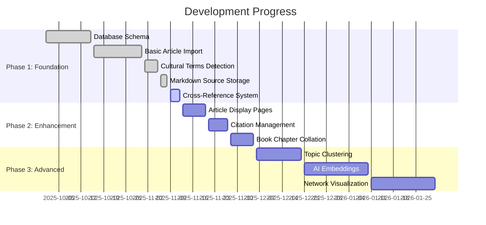
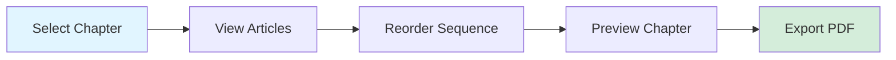
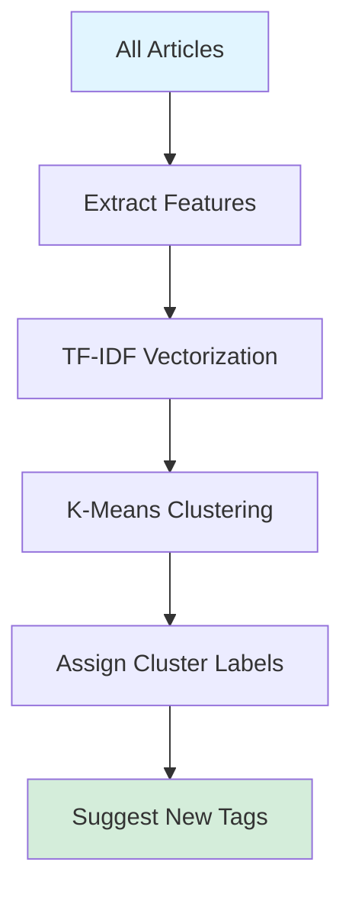
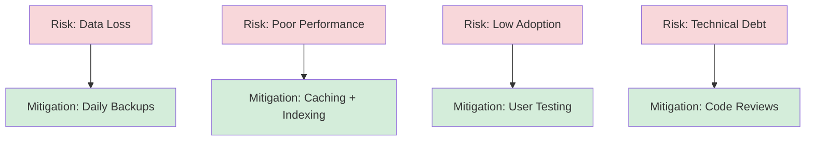

# Implementation Roadmap

Strategic plan for Srangam platform development with priorities and timelines.

## Current Status (2025-11-09)



## Priority Matrix

```mermaid
quadrantChart
    title Feature Priority Matrix
    x-axis Low Effort --> High Effort
    y-axis Low Impact --> High Impact
    quadrant-1 Strategic (Plan)
    quadrant-2 Quick Wins (Do Now)
    quadrant-3 Low Priority (Defer)
    quadrant-4 Major Projects (Plan Carefully)
    
    Cross-Reference Detection: [0.3, 0.9]
    Article Display Component: [0.2, 0.8]
    Citation Improvement: [0.4, 0.6]
    Book Collation UI: [0.6, 0.7]
    Topic Clustering: [0.7, 0.8]
    AI Embeddings: [0.8, 0.9]
    Network Graph: [0.9, 0.7]
    Manual Curation Tool: [0.5, 0.5]
```

## Phase 1: Foundation ✅ (Complete)

### Completed Features

- [x] Database schema design
- [x] Article import pipeline
- [x] Frontmatter YAML parsing
- [x] Cultural terms extraction
- [x] Markdown source storage
- [x] Cross-reference detection
- [x] Admin import UI

### Success Metrics

- ✅ 1 article successfully imported
- ✅ 217+ cultural terms detected
- ✅ Markdown source saved with unique constraint
- ✅ 5+ cross-references auto-generated

## Phase 2: Enhancement 🚧 (In Progress)

### 2.1 Article Display (Nov 13-20)

**Tasks:**
- [ ] Create article detail page (`/articles/[slug]`)
- [ ] Integrate `ArticleCrossReferences` component
- [ ] Display cultural terms with tooltips
- [ ] Add citation references
- [ ] Implement breadcrumb navigation
- [ ] Add share buttons

**Files:**
```
src/
  pages/
    articles/
      [slug].tsx         # New
  components/
    academic/
      ArticleCrossReferences.tsx  # ✅ Created
      CulturalTermTooltip.tsx     # New
      CitationList.tsx            # New
```

**Success Criteria:**
- Article pages load in < 1 second
- Cross-references display correctly
- Cultural terms are interactive
- Mobile-responsive design

### 2.2 Citation Management (Nov 21-27)

**Tasks:**
- [ ] Improve MLA9 citation parsing
- [ ] Create `srangam_citations` table
- [ ] Link citations to articles
- [ ] Bibliography auto-generation
- [ ] Citation export (BibTeX, RIS)

**Database Migration:**
```sql
CREATE TABLE srangam_citations (
  id UUID PRIMARY KEY DEFAULT gen_random_uuid(),
  article_id UUID REFERENCES srangam_articles(id),
  citation_text TEXT NOT NULL,
  citation_type TEXT, -- 'inline', 'footnote', 'bibliography'
  url TEXT,
  page_number INT,
  created_at TIMESTAMP WITH TIME ZONE DEFAULT NOW()
);

CREATE INDEX idx_citations_article ON srangam_citations(article_id);
```

### 2.3 Book Chapter Collation (Nov 28 - Dec 5)

**Tasks:**
- [ ] Activate "Book Collation" tab
- [ ] Chapter preview with article ordering
- [ ] Drag-and-drop article sequencing
- [ ] Chapter export (PDF, EPUB)
- [ ] Table of contents generation

**UI Flow:**


## Phase 3: Advanced Features (Dec 6 - Jan 31)

### 3.1 Topic Clustering (Dec 6-20)

**Algorithm:**


**Implementation:**
- Extract keywords from content
- Calculate TF-IDF scores
- Run k-means (k=10 initial clusters)
- Assign cluster labels to articles
- Suggest additional tags

**Edge Function:**
```typescript
// supabase/functions/analyze-topic-clusters/index.ts
export async function analyzeClusters() {
  const articles = await fetchAllArticles();
  const features = extractTFIDF(articles);
  const clusters = kMeans(features, 10);
  return mapArticlesToClusters(articles, clusters);
}
```

### 3.2 AI Embeddings (Dec 21 - Jan 10)

**Tech Stack:**
- **Model**: `google/gemini-2.5-flash` (via Lovable AI)
- **Vector DB**: `pgvector` extension
- **Similarity**: Cosine distance

**Database Migration:**
```sql
-- Enable pgvector extension
CREATE EXTENSION IF NOT EXISTS vector;

-- Add embedding column
ALTER TABLE srangam_articles
ADD COLUMN content_embedding VECTOR(768);

-- Create vector similarity index
CREATE INDEX idx_articles_embedding 
ON srangam_articles 
USING ivfflat (content_embedding vector_cosine_ops)
WITH (lists = 100);
```

**Edge Function:**
```typescript
// supabase/functions/generate-article-embeddings/index.ts
import { Lovable } from '@lovable/ai';

export async function generateEmbedding(articleId: string) {
  const article = await fetchArticle(articleId);
  const embedding = await Lovable.embed({
    model: 'google/gemini-2.5-flash',
    input: article.content.en,
  });
  
  await supabase
    .from('srangam_articles')
    .update({ content_embedding: embedding })
    .eq('id', articleId);
}
```

**Similarity Search:**
```sql
-- Find similar articles using vector similarity
SELECT 
  id,
  slug,
  title,
  1 - (content_embedding <=> $1::vector) AS similarity
FROM srangam_articles
WHERE id != $2
ORDER BY content_embedding <=> $1::vector
LIMIT 10;
```

**Integration:**
```typescript
// Auto-generate weak cross-references
if (similarity > 0.7) {
  await createCrossReference({
    source: articleId,
    target: similarArticle.id,
    type: 'semantic_similarity',
    strength: Math.round(similarity * 10),
    context: { similarity, method: 'ai_embedding' }
  });
}
```

### 3.3 Network Visualization (Jan 11-31)

**Library**: D3.js force-directed graph

**Features:**
- Interactive node dragging
- Zoom/pan controls
- Color by theme
- Node size by importance (read count)
- Edge thickness by strength
- Filter by reference type
- Search/highlight articles

**Implementation:**
```typescript
// src/components/visualizations/ArticleNetworkGraph.tsx
import * as d3 from 'd3';

export function ArticleNetworkGraph({ articles, crossRefs }) {
  const simulation = d3.forceSimulation(nodes)
    .force('link', d3.forceLink(links).distance(100))
    .force('charge', d3.forceManyBody().strength(-300))
    .force('center', d3.forceCenter(width / 2, height / 2));
  
  // Render SVG with nodes and edges
  // Add interactivity (click, drag, zoom)
}
```

**Data Format:**
```json
{
  "nodes": [
    { "id": "uuid", "label": "Article Title", "theme": "Ancient India", "importance": 10 }
  ],
  "edges": [
    { "source": "uuid1", "target": "uuid2", "type": "thematic", "strength": 7 }
  ]
}
```

## Phase 4: Production Readiness (Feb 1 - Mar 31)

### 4.1 Performance Optimization

- [ ] Implement pagination (50 articles per page)
- [ ] Lazy load article content
- [ ] Edge caching (Cloudflare)
- [ ] Image optimization (WebP, lazy loading)
- [ ] Database query optimization
- [ ] Bundle size reduction (< 200KB initial load)

### 4.2 Testing & Quality

- [ ] Unit tests (Vitest)
- [ ] Integration tests (Playwright)
- [ ] E2E test coverage > 80%
- [ ] Accessibility audit (WCAG 2.1 AA)
- [ ] Performance audit (Lighthouse score > 90)
- [ ] Security audit (OWASP Top 10)

### 4.3 Documentation

- [ ] API documentation (OpenAPI spec)
- [ ] User guide (markdown import workflow)
- [ ] Admin manual (cross-reference curation)
- [ ] Developer onboarding guide
- [ ] Architecture decision records (ADRs)

### 4.4 Monitoring & Analytics

- [ ] Error tracking (Sentry)
- [ ] Usage analytics (privacy-respecting)
- [ ] Performance monitoring (Core Web Vitals)
- [ ] Database metrics dashboard
- [ ] Alert system (uptime, errors)

## Future Enhancements (Backlog)

### Content Management

- [ ] Multi-language support (Hindi, Tamil, Sanskrit)
- [ ] Version control for articles (Git-like)
- [ ] Collaborative editing (real-time)
- [ ] Comment system (moderated)
- [ ] Article review workflow (draft → review → published)

### Research Tools

- [ ] Advanced search (Algolia or Meilisearch)
- [ ] Full-text search with relevance ranking
- [ ] Filter by date range, theme, tags
- [ ] Saved searches & alerts
- [ ] Export search results (CSV, JSON)

### Integration & API

- [ ] Public REST API
- [ ] GraphQL endpoint
- [ ] Webhook notifications
- [ ] Third-party integrations (Zotero, Mendeley)
- [ ] RSS feeds for new articles

### Community Features

- [ ] User profiles & contributions
- [ ] Reading lists & bookmarks
- [ ] Article recommendations
- [ ] Social sharing optimization
- [ ] Newsletter integration

## Risk Management



**Risk Mitigation:**
1. **Data Loss**: Automated backups, version control
2. **Performance**: Load testing, CDN, query optimization
3. **Low Adoption**: User research, iterative design
4. **Technical Debt**: Weekly refactoring, code reviews
5. **Security**: Regular audits, dependency updates

## Success Metrics (OKRs)

### Q4 2025
- **Objective**: Launch MVP with 50+ articles
  - KR1: Import 50 scholarly articles
  - KR2: Extract 1000+ cultural terms
  - KR3: Generate 200+ cross-references
  - KR4: Achieve page load < 2 seconds

### Q1 2026
- **Objective**: Enhance research capabilities
  - KR1: Implement AI semantic search
  - KR2: Build interactive network graph
  - KR3: Support 3 export formats (PDF, EPUB, BibTeX)
  - KR4: Achieve 90+ Lighthouse score

### Q2 2026
- **Objective**: Grow user base
  - KR1: 100+ monthly active users
  - KR2: 500+ article views per week
  - KR3: 50+ cross-reference navigations per day
  - KR4: User satisfaction > 4.5/5

## Decision Log

| Date | Decision | Rationale |
|------|----------|-----------|
| 2025-11-09 | Use Lovable AI instead of OpenAI | No API key required, cost-effective |
| 2025-11-08 | Add unique constraint on markdown sources | Fix upsert 42P10 error |
| 2025-11-06 | Implement bidirectional cross-references | Automatic reverse link discovery |
| 2025-11-01 | Extract cultural terms from italics | High precision with Sanskrit diacritics |
| 2025-10-15 | Use Supabase Edge Functions | Serverless, auto-scaling, cost-effective |
