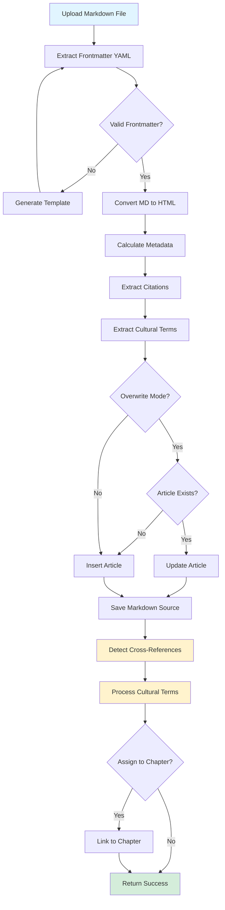
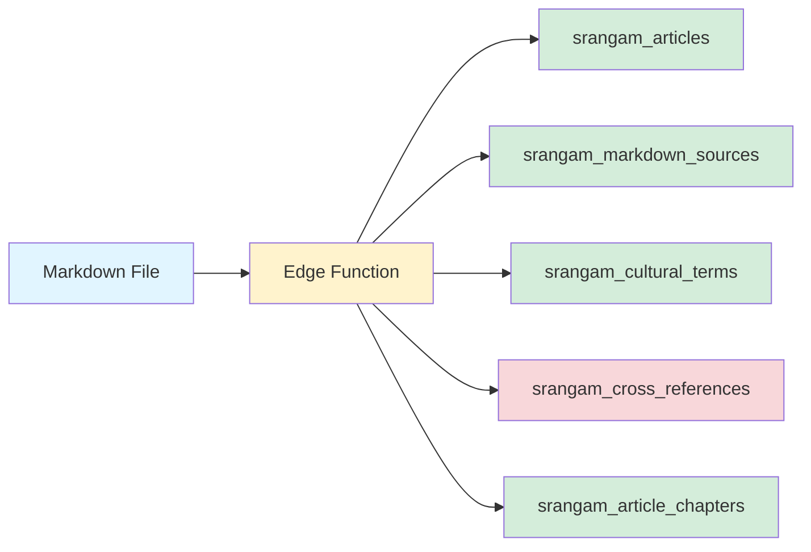
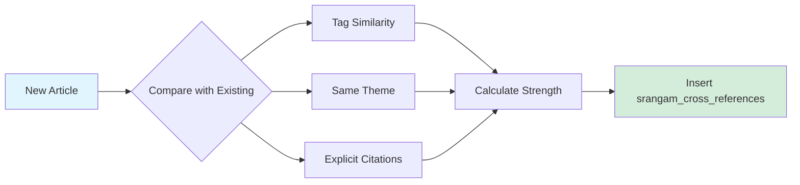
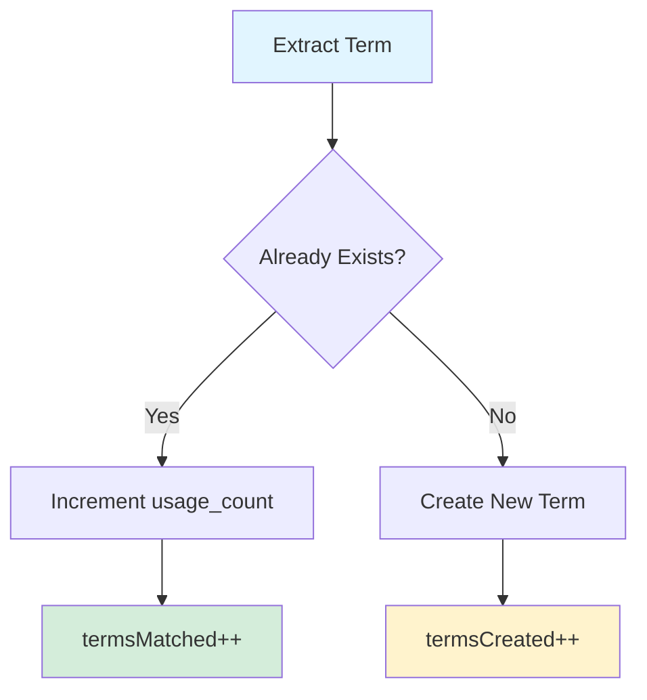
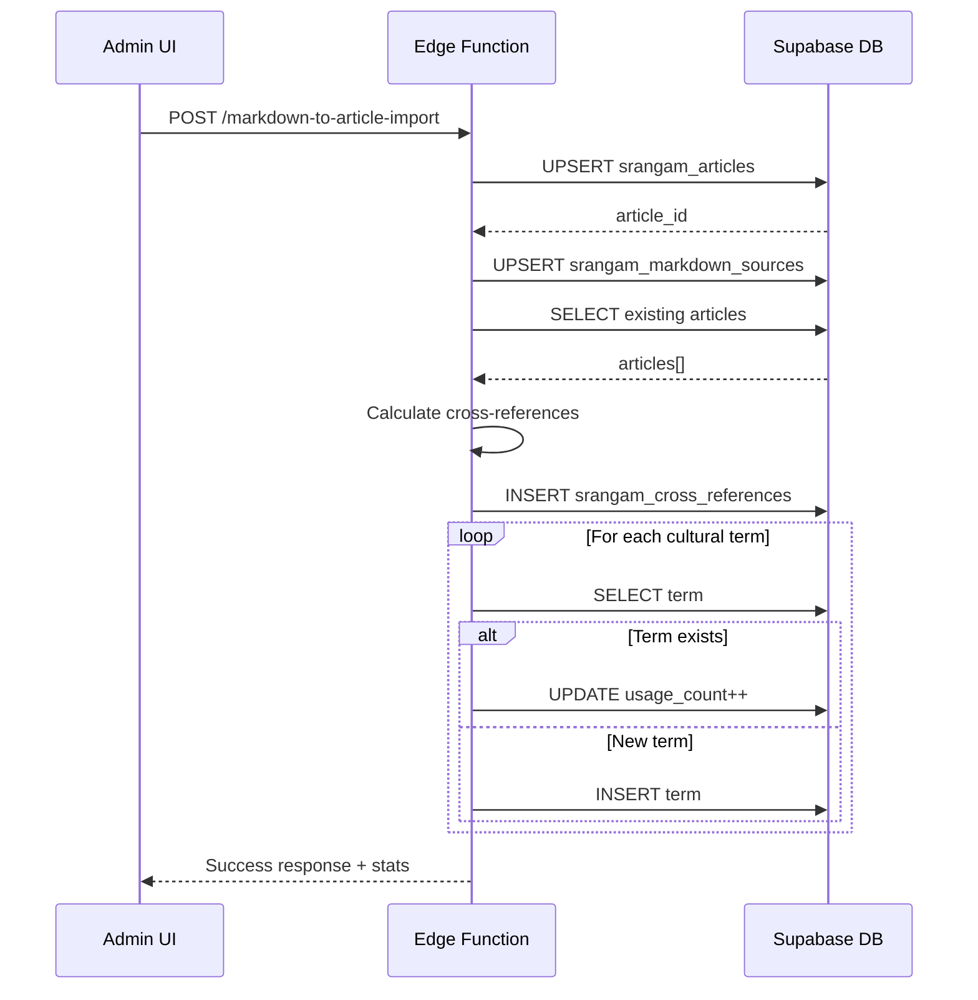
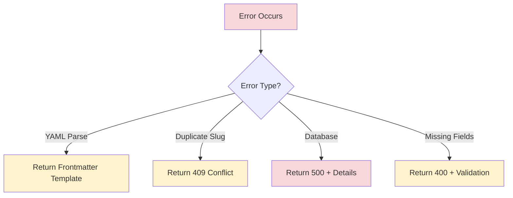
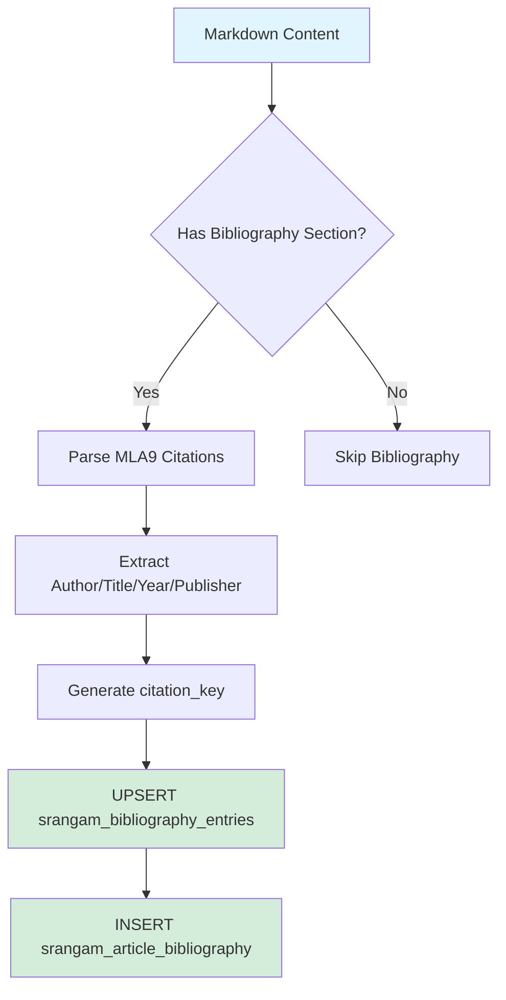
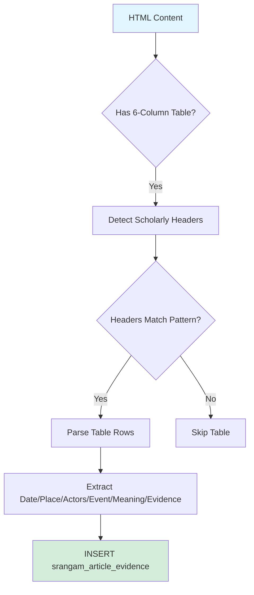

# Markdown Article Import Pipeline

This document describes the complete flow of importing a markdown article into the Srangam database.

## Pipeline Overview



## Data Flow Diagram



## Step-by-Step Process

### 1. Frontmatter Extraction
- Parse YAML frontmatter between `---` delimiters
- Extract: title, author, date, tags, theme, slug, dek
- Validate required fields

### 2. Content Processing
- Convert markdown to HTML using `marked.js`
- Calculate word count and read time (200 words/min)
- Preserve formatting and special characters

### 3. Metadata Extraction

#### Citations
- **Inline MLA9**: `(Author, Title)`
- **Numbered**: `[[1]](url)`
- **Bibliography**: Parse `## Bibliography` section

#### Cultural Terms
- **Italics**: `*dharma*` or `_karma_`
- **Diacritics**: IAST transliteration (ā, ī, ū, ṛ, etc.)
- **Devanagari**: Unicode range `\u0900-\u097F`

### 4. Cross-Reference Detection



**Detection Methods:**
- **Tag Similarity**: 2+ shared tags = thematic link (strength: 2 × tag count)
- **Same Theme**: Exact theme match (strength: 7)
- **Explicit**: Text pattern `(see: article-slug)` (strength: 10)

### 5. Cultural Terms Processing



### 6. Database Operations



## Success Response Schema

```typescript
{
  success: true,
  articleId: "uuid",
  slug: "article-slug",
  stats: {
    wordCount: 2500,
    termsExtracted: 47,
    termsMatched: 35,
    termsCreated: 12,
    citationsCreated: 8,
    readTimeMinutes: 13,
    crossReferencesCreated: 5,
    markdownSourceSaved: true
  }
}
```

## Error Handling



## Performance Considerations

- **Batch Operations**: Cultural terms processed sequentially (intentional for accuracy)
- **Cross-Reference Deduplication**: Filter duplicate source+target+type combinations
- **Lazy Loading**: Markdown source saved with `upsert` (non-blocking)
- **Indexing**: Ensure indexes on `slug`, `tags`, `theme` for fast cross-reference queries

## Step 12: Bibliography Extraction & Storage (NEW - Phase 7)



**MLA9 Parsing Rules**:
- Pattern: `Author Last, First. *Title*. Publisher, Year.`
- Citation key: `lastname_year` (e.g., `olivelle_2013`)
- Deduplicate by `citation_key` (increment `citation_count` if exists)

**Source Quality Detection**:
- Primary: Inscriptions, manuscripts, Akhbarat
- Secondary: Modern scholarship, historical analysis
- Tradition: Oral history, folklore

## Step 13: Evidence Table Data Extraction (NEW - Phase 7)



**Scholarly Table Headers**:
- English: Date | Place | Actors | Event | Meaning | Evidence
- Hindi: तिथि | स्थान | मुख्य पात्र | घटना | महत्व | साक्ष्य-स्थिति

## Future Enhancements

1. **AI Embeddings**: Semantic similarity using Lovable AI (gemini-2.5-flash)
2. **Topic Clustering**: ML-based theme detection
3. **Citation Extraction**: NLP for complex bibliography formats
4. **Version Control**: Track markdown source changes with git-like commits
5. **Conflict Resolution**: UI for resolving duplicate slug conflicts
6. **Geocoding**: Auto-geocode place names from evidence tables
7. **Bibliography Export**: BibTeX/RIS export for citation managers
