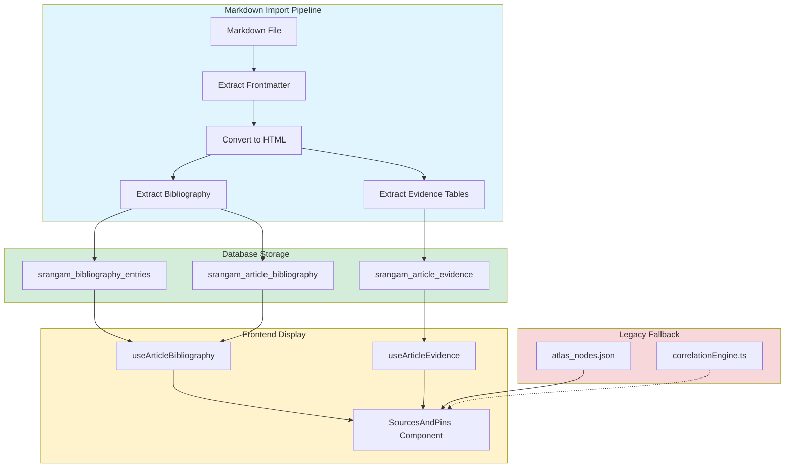
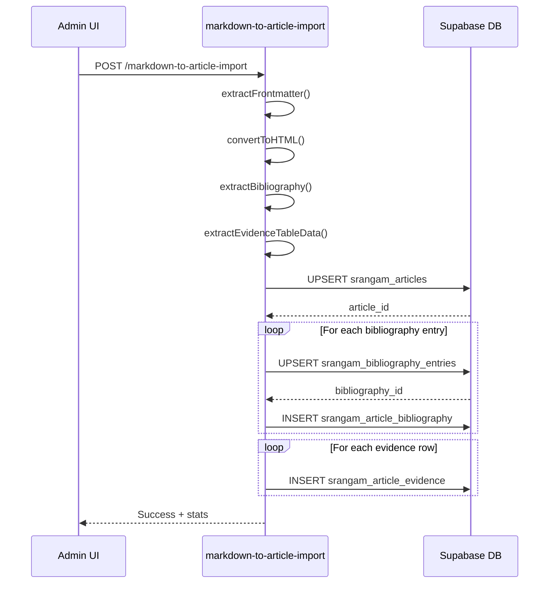
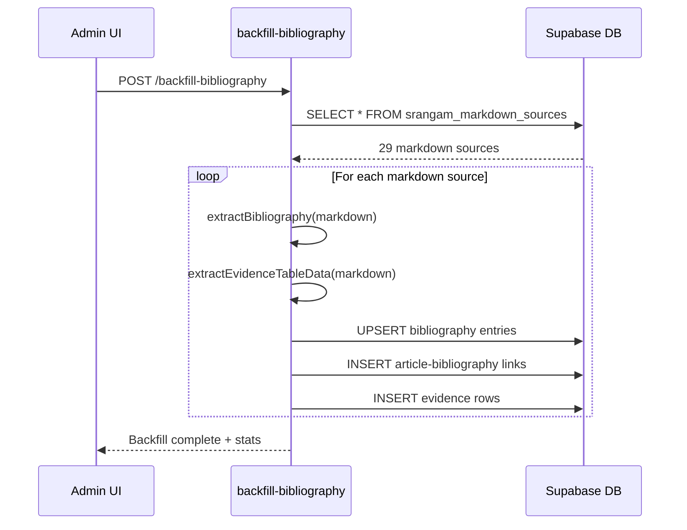
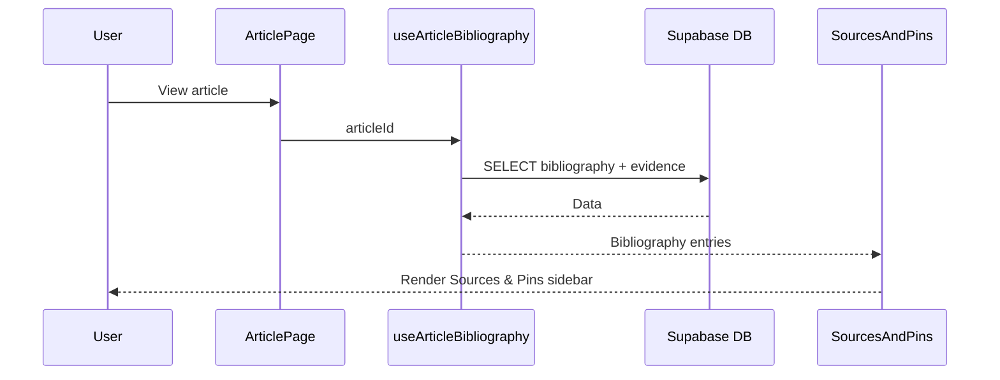

# Sources & Pins System Architecture

**Version**: 1.0  
**Created**: 2025-01-18  
**Status**: Implementation Phase

---

## Overview

The Sources & Pins system provides structured bibliography and geographical evidence display for Srangam articles. This document describes the enterprise architecture for auto-populating sources and pins from article markdown files.

---

## System Architecture



---

## Database Schema

### `srangam_bibliography_entries` (Existing - Currently Empty)

Master bibliography table for deduplicated scholarly citations.

| Column | Type | Description |
|--------|------|-------------|
| `id` | UUID | Primary key |
| `citation_key` | TEXT | Unique key (e.g., "olivelle_2013") |
| `entry_type` | TEXT | "book" \| "article" \| "manuscript" \| "inscription" \| "epigraph" |
| `authors` | JSONB | Array of {first, last, suffix} objects |
| `title` | JSONB | Multilingual title {en, hi, ...} |
| `year` | INTEGER | Publication year |
| `publisher` | TEXT | Publisher name |
| `journal` | TEXT | Journal name (for articles) |
| `volume` | TEXT | Volume number |
| `pages` | TEXT | Page range |
| `doi` | TEXT | Digital Object Identifier |
| `url` | TEXT | Web URL |
| `full_citation_mla` | TEXT | Complete MLA9 formatted citation |
| `full_citation_apa` | TEXT | APA formatted citation |
| `full_citation_chicago` | TEXT | Chicago formatted citation |
| `tags` | TEXT[] | Subject tags |
| `citation_count` | INTEGER | Number of articles citing this entry |
| `created_at` | TIMESTAMPTZ | Creation timestamp |

### `srangam_article_bibliography` (Existing - Currently Empty)

Junction table linking articles to bibliography entries.

| Column | Type | Description |
|--------|------|-------------|
| `id` | UUID | Primary key |
| `article_id` | UUID | FK to srangam_articles |
| `bibliography_id` | UUID | FK to srangam_bibliography_entries |
| `is_primary_source` | BOOLEAN | True if primary source (inscriptions, manuscripts) |
| `citation_context` | TEXT | How citation is used in article |
| `page_numbers` | TEXT | Specific pages referenced |
| `quote` | TEXT | Direct quote from source |
| `created_at` | TIMESTAMPTZ | Creation timestamp |

### `srangam_article_evidence` (NEW)

Structured evidence data extracted from 6-column scholarly tables.

| Column | Type | Description |
|--------|------|-------------|
| `id` | UUID | Primary key |
| `article_id` | UUID | FK to srangam_articles (CASCADE DELETE) |
| `date_approx` | TEXT | Approximate date (e.g., "1691 CE", "c. 1750") |
| `place` | TEXT | Location name |
| `actors` | TEXT[] | Historical figures involved |
| `event_description` | TEXT | Event narrative |
| `significance` | TEXT | Historical meaning/importance |
| `source_quality` | TEXT | "primary" \| "secondary" \| "tradition" |
| `latitude` | DECIMAL | Geographic latitude (if geocoded) |
| `longitude` | DECIMAL | Geographic longitude (if geocoded) |
| `created_at` | TIMESTAMPTZ | Creation timestamp |

---

## Bibliography Extraction

### MLA9 Citation Parsing

The system parses MLA9 formatted bibliography entries:

```
Author Last, First. Title of Work. Publisher, Year.
Singh, Ganda. Ahmad Shah Durrani: Father of Modern Afghanistan. Asia Publishing House, 1959.
```

**Extraction Pattern**:
```typescript
interface BibliographyEntry {
  citation_key: string;        // "singh_1959"
  entry_type: string;          // "book"
  authors: { first: string; last: string }[];
  title: string;
  year: number | null;
  publisher?: string;
  full_citation_mla: string;   // Original string
  tags: string[];
}
```

### Source Quality Detection

From 6-column evidence tables, detect source quality:

| Indicator | Quality | Badge Color |
|-----------|---------|-------------|
| "Primary source", "Inscription", "Akhbarat", "Manuscript" | `primary` | Emerald |
| "Secondary source", "Historical analysis", "Modern scholarship" | `secondary` | Amber |
| "Oral tradition", "Folklore", "Local memory" | `tradition` | Slate |

---

## Evidence Table Format

### Standard 6-Column Scholarly Table

**English Headers**:
```markdown
| Date | Place | Actors | Event | Meaning | Evidence |
|------|-------|--------|-------|---------|----------|
```

**Hindi Headers**:
```markdown
| तिथि | स्थान | मुख्य पात्र | घटना | महत्व | साक्ष्य-स्थिति |
|------|-------|------------|-------|-------|---------------|
```

**Extraction Function**:
```typescript
function extractEvidenceTableData(htmlContent: string): EvidenceEntry[] {
  // 1. Find tables with 6+ columns
  // 2. Check for scholarly headers (Date/Place/Event OR तिथि/स्थान/घटना)
  // 3. Parse each row into structured EvidenceEntry
  // 4. Detect source_quality from Evidence column
  return entries;
}
```

---

## Data Flow

### Import Flow (New Articles)



### Backfill Flow (Existing Articles)



### Display Flow



---

## Legacy Compatibility

### Fallback Chain

1. **Database First**: Query `srangam_article_bibliography` + `srangam_article_evidence`
2. **Atlas Nodes**: If empty, check `atlas_nodes.json` for matching article slug
3. **Correlation Engine**: Deprecated, shows console warning

### Graceful Degradation

```typescript
const { data: bibliography } = useArticleBibliography(articleId);
const { data: evidence } = useArticleEvidence(articleId);

if (!bibliography?.length && !evidence?.length) {
  // Check legacy atlas_nodes.json
  const atlasMatch = atlasNodes.features.find(
    f => f.properties.articleSlug === articleSlug
  );
  
  if (!atlasMatch) {
    return <NoSourcesMessage />;
  }
}
```

---

## Implementation Phases

### Phase 1: Database Migration ✓
- Add `srangam_article_evidence` table
- Enable RLS policies

### Phase 2: Bibliography Extraction
- Enhance `extractCitations()` → `extractBibliography()`
- Parse MLA9 format
- Save to bibliography tables

### Phase 3: Evidence Table Extraction
- Add `extractEvidenceTableData()` function
- Parse 6-column scholarly tables
- Save to evidence table

### Phase 4: Backfill Existing Articles
- Create `backfill-bibliography` edge function
- Process 29 existing markdown sources

### Phase 5: Frontend Integration
- Create `useArticleBibliography` hook
- Create `useArticleEvidence` hook
- Update `SourcesAndPins` component
- Add legacy fallback logic

---

## Testing Plan

1. **Unit Tests**: MLA9 parsing, evidence table detection
2. **Integration Tests**: Full import → display cycle
3. **Backfill Verification**: Verify all 29 articles populated
4. **Regression Tests**: Legacy articles still display

---

## Performance Considerations

- **Batch Operations**: Bibliography entries inserted in batches
- **Caching**: React Query caches bibliography data
- **Indexing**: Ensure indexes on `article_id` columns
- **Deduplication**: Bibliography entries deduplicated by `citation_key`

---

## Future Enhancements

1. **Geocoding**: Auto-geocode place names from evidence tables
2. **Citation Verification**: Link to DOI/ISBN databases
3. **Export**: Bibliography export in BibTeX format
4. **Collaboration**: Manual bibliography curation UI
