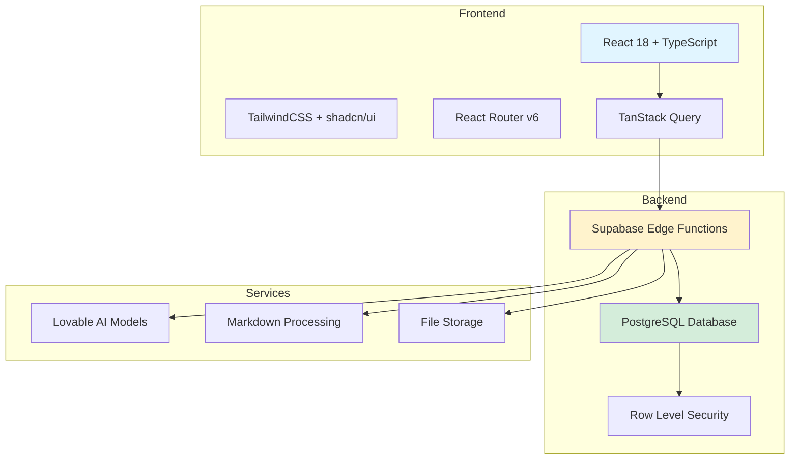
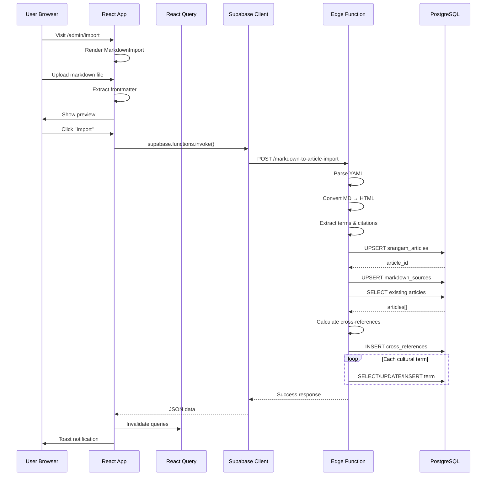
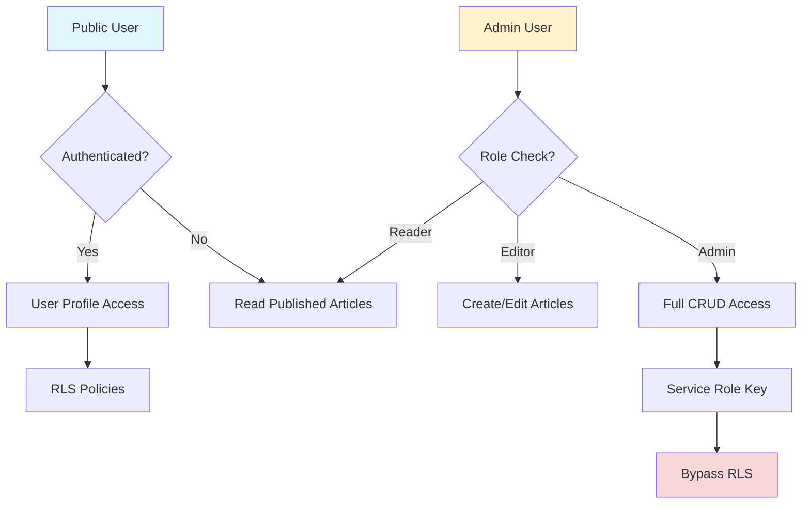
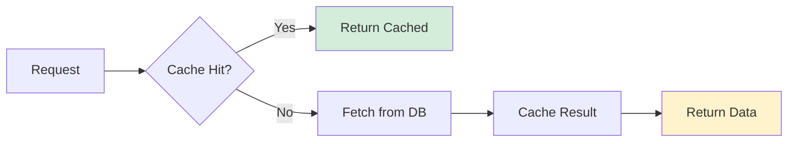
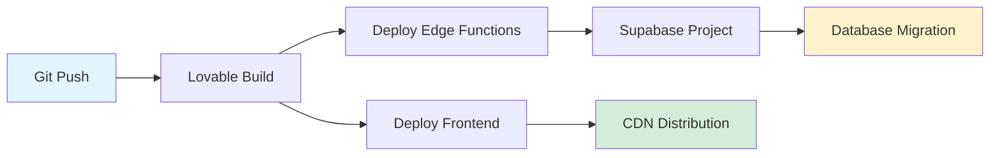
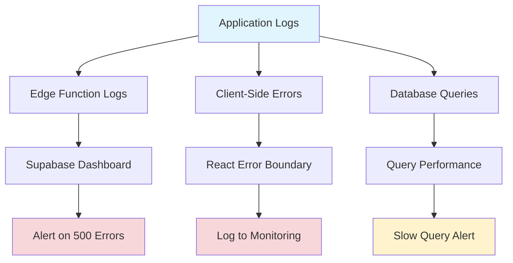
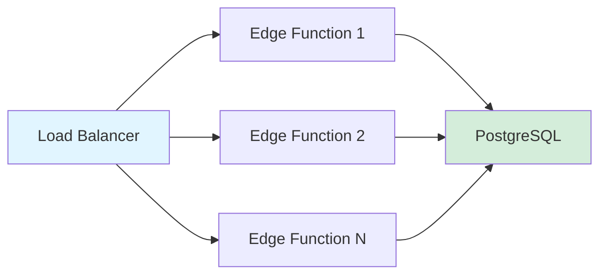
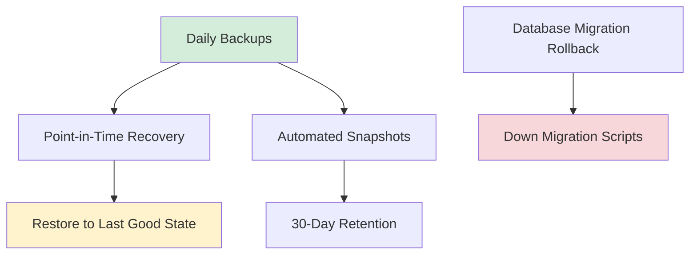

# Srangam System Architecture

High-level architecture of the Srangam digital archive platform.

## Stack Overview



## Data Architecture

```mermaid
erDiagram
    srangam_articles ||--o{ srangam_article_chapters : "article_id"
    srangam_articles ||--o{ srangam_markdown_sources : "article_id"
    srangam_articles ||--o{ srangam_cross_references : "source_article_id"
    srangam_articles ||--o{ srangam_cross_references : "target_article_id"
    
    srangam_book_chapters ||--o{ srangam_article_chapters : "chapter_id"
    
    srangam_cultural_terms ||--o{ article_term_usage : "term_id"
    srangam_articles ||--o{ article_term_usage : "article_id"
    
    srangam_articles {
        uuid id PK
        text slug UK
        jsonb title
        jsonb content
        text author
        date published_date
        text theme
        text[] tags
        int read_time_minutes
        text status
        boolean featured
        timestamp created_at
    }
    
    srangam_markdown_sources {
        uuid id PK
        uuid article_id FK UK
        text markdown_content
        text file_path
        text sync_status
        timestamp last_sync_at
    }
    
    srangam_cross_references {
        uuid id PK
        uuid source_article_id FK
        uuid target_article_id FK
        text reference_type
        int strength
        boolean bidirectional
        jsonb context_description
    }
    
    srangam_cultural_terms {
        uuid id PK
        text term UK
        jsonb translations
        jsonb etymology
        jsonb cultural_context
        int usage_count
        text module
    }
    
    srangam_book_chapters {
        uuid id PK
        text chapter_id UK
        int volume
        int chapter_number
        text title
        text description
    }
```

## Request Flow



## Module Structure

```
src/
├── components/
│   ├── academic/
│   │   ├── ArticleCrossReferences.tsx
│   │   ├── CrossReferencePanel.tsx
│   │   └── CulturalTermsPanel.tsx
│   └── ui/                     # shadcn components
├── pages/
│   ├── admin/
│   │   ├── MarkdownImport.tsx
│   │   └── CrossReferenceManager.tsx (future)
│   └── articles/
│       └── [slug].tsx
├── integrations/
│   └── supabase/
│       ├── client.ts           # Auto-generated
│       └── types.ts            # Auto-generated
└── hooks/
    └── use-toast.ts

supabase/
└── functions/
    └── markdown-to-article-import/
        └── index.ts

docs/
└── architecture/
    ├── IMPORT_PIPELINE.md
    ├── CROSS_REFERENCE_SYSTEM.md
    ├── SYSTEM_ARCHITECTURE.md
    └── IMPLEMENTATION_ROADMAP.md
```

## Security Architecture



**Row Level Security (RLS):**
- ✅ `srangam_articles`: Published articles visible to all
- ✅ `srangam_cultural_terms`: Read-only for public
- ✅ `srangam_cross_references`: Read-only for public
- 🔐 `srangam_markdown_sources`: Admin only
- 🔐 Edge functions: Service role key for write operations

## Performance Optimization

### Caching Strategy



**React Query Configuration:**
```typescript
{
  staleTime: 5 * 60 * 1000,    // 5 minutes
  cacheTime: 30 * 60 * 1000,   // 30 minutes
  refetchOnWindowFocus: false,
  refetchOnMount: false
}
```

### Database Indexing

```sql
-- Articles table
CREATE INDEX idx_articles_slug ON srangam_articles(slug);
CREATE INDEX idx_articles_status ON srangam_articles(status);
CREATE INDEX idx_articles_tags ON srangam_articles USING GIN(tags);
CREATE INDEX idx_articles_theme ON srangam_articles(theme);

-- Cross-references
CREATE INDEX idx_xref_source ON srangam_cross_references(source_article_id);
CREATE INDEX idx_xref_target ON srangam_cross_references(target_article_id);
CREATE INDEX idx_xref_strength ON srangam_cross_references(strength DESC);

-- Cultural terms
CREATE INDEX idx_terms_usage ON srangam_cultural_terms(usage_count DESC);
CREATE INDEX idx_terms_module ON srangam_cultural_terms(module);

-- Markdown sources
CREATE UNIQUE INDEX idx_markdown_article ON srangam_markdown_sources(article_id);
```

## Deployment Flow



**Automatic Deployment:**
1. Push to GitHub
2. Lovable detects changes
3. Build React app (Vite)
4. Deploy edge functions to Supabase
5. Run pending database migrations
6. Invalidate CDN cache
7. Update type definitions

## Monitoring & Observability



**Key Metrics:**
- Edge function invocation count
- Average response time
- Failed import rate
- Cross-reference creation rate
- Cultural term extraction accuracy
- Database query performance

## Scalability Considerations

### Horizontal Scaling



**Supabase Auto-Scaling:**
- Edge functions scale automatically
- Database connection pooling (PgBouncer)
- Read replicas for heavy queries (future)

### Data Partitioning (Future)

```sql
-- Partition articles by publication year
CREATE TABLE srangam_articles_2024 
PARTITION OF srangam_articles
FOR VALUES FROM ('2024-01-01') TO ('2025-01-01');

CREATE TABLE srangam_articles_2025
PARTITION OF srangam_articles
FOR VALUES FROM ('2025-01-01') TO ('2026-01-01');
```

## Disaster Recovery



**Backup Strategy:**
- **Database**: Automated daily backups (30-day retention)
- **Markdown Sources**: Version controlled in Git
- **Edge Functions**: Deployed from source control
- **Frontend**: CDN cached + Git repository

## Tech Stack Summary

| Layer | Technology | Purpose |
|-------|-----------|---------|
| Frontend | React 18 + TypeScript | UI components |
| Styling | TailwindCSS + shadcn/ui | Design system |
| State | TanStack Query | Server state caching |
| Routing | React Router v6 | Client-side routing |
| Backend | Supabase Edge Functions | Serverless compute |
| Database | PostgreSQL 15 | Relational data |
| Auth | Supabase Auth | User management |
| Storage | Supabase Storage | File uploads |
| AI | Lovable AI (Gemini 2.5) | Future embeddings |
| Markdown | marked.js | MD → HTML |
| YAML | Deno std/yaml | Frontmatter parsing |
| Build | Vite | Fast bundling |
| Deploy | Lovable Cloud | Automatic CD |
